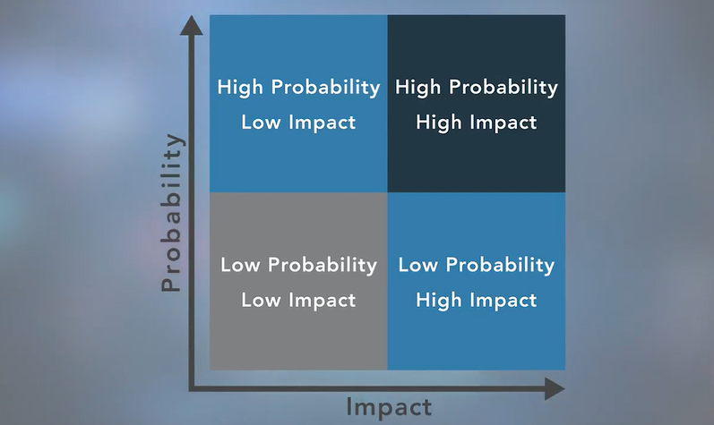

# Guida Studio Certificazione Cybersecurity

---

## Indice dei Contenuti
1. [Professional Code of Conduct](#1-professional-code-of-conduct-codice-etico-professionale)
2. [Governance](#2-governance-governance-aziendale)
3. [Il Triangolo della Sicurezza: CIA](#3-il-triangolo-della-sicurezza-cia)
4. [Secrecy](#4-secrecy-retezza)
5. [Privacy](#5-privacy)
6. [PII](#6-pii-personally-identifiable-information)
7. [Standard e Framework](#7-standard-e-framework-di-cybersecurity)
8. [Best Practice](#8-best-practice-per-la-cybersecurity)
9. [Authentication](#9-authentication-autenticazione)
10. [Incident Response](#10-incident-response-and-management-gestione-e-risposta-agli-incidenti)
11. [Risk Management](#11-risk-management-gestione-del-rischio)
12. [Security Controls e Risk Management](#12-security-controls-e-risk-management)
13. [Threats, Vulnerabilities, Attack Vectors](#13-threats-vulnerabilities-attack-vectors-and-likelihood)
14. [Cloud Computing Models](#14-cloud-computing-models)
15. [Domande d'Esame](#15-domande-desame-e-spiegazioni)
16. [Glossario](#16-glossario)

---

## 1. Professional Code of Conduct (Codice Etico Professionale)

### **1.1 Importanza del Codice Etico**

Tutti i professionisti della sicurezza informatica che sono certificati da **ISC2** riconoscono che:
- La **certificazione è un privilegio** che deve essere sia guadagnato che mantenuto
- Ogni membro ISC2 è **tenuto a impegnarsi** a supportare pienamente il Codice Etico ISC2

> **Principio fondamentale:** I professionisti della sicurezza informatica sono tenuti a mantenere una condotta onorevole, onesta, giusta, responsabile e legale, come menzionato nel codice etico.

### **1.2 ISC2 Code of Ethics - Preamble (Preambolo)**

Il **Preambolo** stabilisce lo scopo e l'intento del Codice Etico ISC2:

> *"La sicurezza e il benessere della società e del bene comune, il dovere verso i nostri principi, e il dovere reciproco richiedono che aderiamo e siamo visti aderire ai più alti standard etici di comportamento."*

**Conseguenza diretta:**
- La **rigorosa aderenza a questo Codice** è una **condizione per la certificazione**
- Non è opzionale, ma obbligatoria per mantenere la certificazione

### **1.3 ISC2 Code of Ethics - Canons (Canoni)**

I **Canoni** rappresentano le credenze importanti condivise dai membri di ISC2. I professionisti di cybersecurity membri di ISC2 hanno un dovere verso le seguenti **quattro entità**:

#### **Canon 1: Protect Society (Proteggere la Società)**
> *"Protect society, the common good, necessary public trust and confidence, and the infrastructure."*
- **Proteggere la società, il bene comune, la fiducia pubblica necessaria e la confidenza, e l'infrastruttura**
- **Responsabilità:**
  - Salvaguardare le infrastrutture critiche
  - Mantenere la fiducia del pubblico nella tecnologia
  - Considerare l'impatto sociale delle decisioni di sicurezza
  - Proteggere il bene comune sopra gli interessi personali

#### **Canon 2: Act Honorably (Agire Onorevolmente)**
> *"Act honorably, honestly, justly, responsibly, and legally."*
- **Agire in modo onorevole, onesto, giusto, responsabile e legale**
- **Principi di comportamento:**
  - **Onore**: mantenere la dignità professionale
  - **Onestà**: essere veritieri in tutte le comunicazioni
  - **Giustizia**: trattare tutti equamente
  - **Responsabilità**: assumersi la responsabilità delle proprie azioni
  - **Legalità**: rispettare tutte le leggi applicabili

#### **Canon 3: Provide Diligent Service (Fornire Servizio Diligente)**
> *"Provide diligent and competent service to principals."*
- **Fornire un servizio diligente e competente ai principi**
- **Requisiti professionali:**
  - Mantenere competenze aggiornate
  - Fornire consulenza professionale accurata
  - Dichiarare conflitti di interesse
  - Non accettare incarichi oltre le proprie competenze
  - Mantenere la riservatezza quando richiesto

#### **Canon 4: Advance the Profession (Far Progredire la Professione)**
> *"Advance and protect the profession."*
- **Far progredire e proteggere la professione**
- **Contributi alla professione:**
  - Mentorare nuovi professionisti
  - Condividere conoscenze e best practice
  - Sostenere l'educazione e la formazione continua
  - Promuovere standard etici elevati
  - Contribuire al progresso della sicurezza informatica

### **1.4 Applicazione Pratica del Codice Etico**

#### **Situazioni comuni che richiedono considerazioni etiche:**
- **Disclosure di vulnerabilità**: bilanciare la sicurezza pubblica con la responsabilità verso il datore di lavoro
- **Conflitti di interesse**: quando gli interessi personali potrebbero interferire con il dovere professionale
- **Competenza professionale**: riconoscere i propri limiti e cercare aiuto quando necessario
- **Riservatezza**: proteggere informazioni sensibili pur mantenendo trasparenza appropriata

#### **Conseguenze della violazione del codice:**
- Revoca della certificazione
- Danneggiamento della reputazione professionale
- Possibili conseguenze legali
- Perdita della fiducia dei clienti e colleghi

> **Ricorda:** Il codice etico non è solo un insieme di regole, ma una guida per prendere decisioni difficili in situazioni complesse. Quando in dubbio, considera sempre l'impatto sulla società, sull'onore professionale, sul servizio ai clienti, e sul progresso della professione.

---

## 2. Governance (Governance Aziendale)

### **2.1 Definizione e Scopo**

Ogni azienda o organizzazione esiste per **adempiere a uno scopo**, che sia:
- Fornire materie prime a un'industria
- Produrre attrezzature per hardware informatico
- Sviluppare applicazioni software
- Costruire edifici
- Fornire beni e servizi

Per completare l'obiettivo è necessario che:
- Le **decisioni vengano prese**
- **Regole e pratiche** vengano definite
- **Politiche e procedure** siano in atto per guidare l'organizzazione nel perseguimento dei suoi obiettivi e missione

> **Governance:** Il sistema di strutture e processi che dirigono e controllano le organizzazioni per raggiungere i loro obiettivi.

### **2.2 Gli Elementi della Governance**

La governance si basa su una **gerarchia di elementi** che si influenzano a cascata:

```
Governance
    ↓
Regulations → Standards → Policies → Procedures
```

#### **Flusso gerarchico:**
1. **Regulations** (Normative) stabiliscono i requisiti legali
2. **Standards** (Standard) forniscono framework e best practice
3. **Policies** (Politiche) definiscono la direzione strategica
4. **Procedures** (Procedure) specificano i passaggi operativi

### **2.3 Regulations and Laws (Normative e Leggi)**

#### **Definizione:**
- **Normative e sanzioni** possono essere imposte dai governi a livello nazionale, regionale o locale
- Portano tipicamente **penali finanziarie** per la non conformità
- Possono essere imposte e applicate diversamente in diverse parti del mondo

#### **Esempi di normative chiave:**

**HIPAA (Health Insurance Portability and Accountability Act)**
- Legge statunitense del 1996
- Governa l'uso delle **informazioni sanitarie protette (PHI)**
- Violazioni comportano possibili multe e/o reclusione per individui e aziende

**GDPR (General Data Protection Regulation)**
- Regolamento dell'Unione Europea per controllare l'uso delle **PII** dei cittadini UE
- Applica **sanzioni finanziarie** anche alle aziende senza presenza fisica nell'UE
- Ha **portata internazionale**

#### **Compliance Multi-livello:**
- Le organizzazioni multinazionali sono soggette a normative in **più nazioni**
- Devono considerare normative a tutti i livelli: **nazionale, regionale, locale**
- Devono essere conformi alla **normativa più restrittiva**

### **2.4 Standards (Standard)**

#### **Definizione e Ruolo:**
- Le organizzazioni utilizzano **standard multipli** come parte dei loro programmi di sicurezza
- Servono sia come **documenti di compliance** che come guide consultive
- Forniscono garanzia che l'organizzazione opera con politiche e procedure che supportano normative e best practice

#### **Organizzazioni di Standardizzazione Principali:**

**ISO (International Organization for Standardization)**
- Sviluppa standard internazionali su vari argomenti tecnici
- Include sistemi informativi, sicurezza informatica, standard di crittografia
- Raccoglie input dalla comunità internazionale di esperti
- Standard acquistabili online

**NIST (National Institute of Standards and Technology)**
- Agenzia governativa USA sotto il Dipartimento del Commercio
- Pubblica standard tecnici, IT e sicurezza informatica
- Standard gratuiti scaricabili dal sito NIST
- Molti standard sono requisiti per agenzie governative USA
- Considerati standard raccomandati dall'industria mondiale

**IETF (Internet Engineering Task Force)**
- Sviluppa standard per **protocolli di comunicazione**
- Garantisce che tutti i computer possano connettersi attraverso i confini
- Permette comunicazione anche quando gli operatori non parlano la stessa lingua

**IEEE (Institute of Electrical and Electronics Engineers)**
- Stabilisce standard per telecomunicazioni, ingegneria informatica, discipline simili

### **2.5 Policies (Politiche)**

#### **Definizione e Caratteristiche:**
- Le **politiche sono informate dalle leggi applicabili** e specificano quali standard e linee guida l'organizzazione seguirà
- Sono **ampie ma non dettagliate**
- Stabiliscono il contesto e definiscono direzione strategica e priorità
- Sono usate per moderare e controllare il processo decisionale

#### **Livelli delle Politiche:**

**Politiche di Alto Livello:**
- Utilizzate dai dirigenti senior per **plasmare e controllare** i processi decisionali
- Dirigono il comportamento dell'intera organizzazione verso obiettivi

**Politiche di Governance:**
- Assicurano compliance quando necessario
- Guidano la creazione e implementazione di altre politiche

**Politiche Funzionali:**
- Aree specifiche come:
  - Gestione risorse umane
  - Finanza e contabilità
  - Sicurezza e protezione degli asset
- Possono essere richieste da leggi, normative o contratti

#### **Esempi di Policy Chiave in Cybersecurity:**

1. **Acceptable Use Policy (AUP)**
   - Definisce le regole di comportamento per l'uso delle risorse aziendali (computer, reti, email).
   - Stabilisce cosa è permesso e cosa è vietato (es. navigazione su siti non appropriati).
   - *Rationale*: Assicura che gli utenti siano consapevoli delle loro responsabilità.

2. **Bring Your Own Device (BYOD) Policy**
   - Stabilisce le regole per l'utilizzo di dispositivi personali (smartphone, tablet, laptop) per scopi lavorativi.
   - Definisce i requisiti di sicurezza (es. obbligo di PIN/password, crittografia) e cosa succede ai dati aziendali se il dipendente lascia l'azienda (es. Remote Wipe).
   - *Esempio*: Chi vuole usare il proprio iPad per le email aziendali deve prima accettare questa policy.

3. **Privacy Policy**
   - Documento (spesso esterno/rivolto ai clienti) che spiega come l'organizzazione raccoglie, usa, archivia e protegge i dati personali (PII/PHI).

4. **Change Management Policy**
   - Stabilisce un processo formale per autorizzare e gestire le modifiche ai sistemi IT.
   - Obiettivo: Ridurre disservizi e rischi di sicurezza dovuti a cambiamenti non controllati.

5. **Non-Disclosure Agreement (NDA)**
   - Accordo legale che vincola le parti a non divulgare informazioni riservate.

### **2.6 Procedures (Procedure)**

#### **Definizione:**
- Le **politiche sono implementate dalle persone** attraverso procedure
- Espandono le politiche da dichiarazioni di intenti a **istruzioni passo-passo**
- Definiscono attività esplicite e ripetibili necessarie per compiti specifici

#### **Caratteristiche delle Procedure:**
- Forniscono **dati di supporto, criteri decisionali** o conoscenze esplicite
- Possono indirizzare azioni **una tantum o ricorrenti**
- Stabiliscono **criteri di misurazione** per determinare il completamento con successo
- Richiedono **documentazione appropriata** e formazione del personale

### **2.7 Guidelines (Linee Guida)**

#### **Definizione e Scopo:**
- Le **Guidelines** sono raccomandazioni o suggerimenti progettati per guidare utenti, azioni o strategie.
- A differenza di Policies, Procedures e Regulations, le Guidelines **NON sono obbligatorie** (not mandatory).
- Forniscono **best practice** e consigli che permettono flessibilità nell'implementazione.

#### **Differenza Chiave:**
> Mentre **Policies, Procedures e Regulations** richiedono conformità obbligatoria (Mandatory), le **Guidelines** sono discrezionali.

**Esempio:** 
- Una *policy* impone "Tutte le password devono essere complesse".
- Una *procedure* spiega "Come cambiare la password in Active Directory".
- Una *guideline* suggerisce "Si consiglia di usare frasi mnemoniche (passphrases) per creare password facili da ricordare".

### **2.8 Relazione tra gli Elementi**

**Visione dal basso verso l'alto:**

- **Procedures** = Passi dettagliati per completare compiti che supportano le politiche
- **Policies** = Guidance (ma mandataria) per le attività
- **Standards** = Framework per introdurre politiche e procedure
- **Regulations** = Leggi con penali finanziarie
- **Guidelines** = Raccomandazioni non obbligatorie di supporto

**Flusso decisionale:**
```
Regulations → Standards → Policies → Procedures
     (con Guidelines a supporto laterale)
```

### **2.9 Governance nella Cybersecurity**

**Aspetti chiave:**
- La governance di cybersecurity deve **allinearsi** con la governance aziendale generale
- Richiede **supporto del senior management** e board of directors
- Deve bilanciare **requisiti di sicurezza** con **obiettivi di business**
- Necessita di **monitoraggio continuo** e aggiornamenti per nuove minacce/normative

---

## 3. Il Triangolo della Sicurezza: CIA

### **3.1 Confidentiality (Riservatezza)**
- Garantire l’accesso alle informazioni solo agli utenti autorizzati.
- Prevenire la divulgazione non autorizzata dei dati.
- Si può ottenere tramite controlli di accesso, crittografia, politiche di sicurezza.

### **3.2 Integrity (Integrità)**
- Assicurare che le informazioni siano accurate, complete, coerenti e affidabili.
- Le informazioni devono essere protette da modifiche o cancellazioni non autorizzate.
- Si può ottenere tramite controlli di versione, checksum, firme digitali, audit.

### **3.3 Availability (Disponibilità)**
- I sistemi e i dati devono essere accessibili agli utenti autorizzati quando necessario.
- Include la protezione da downtime, attacchi DoS, guasti hardware.
- Si può ottenere tramite backup, sistemi ridondanti, disaster recovery.

---

## 4. Secrecy (Segretezza)
- Sinonimo pratico di **confidentiality**.
- Consiste nella protezione delle informazioni affinché siano accessibili solo agli autorizzati e nascoste agli altri.
- Si raggiunge con tecniche come crittografia, access control, policy di sicurezza.

---

## 5. Privacy

### **5.1 Definizione**
- È il diritto dell’individuo di controllare la distribuzione e l’uso delle proprie informazioni personali.

### **5.2 Differenze fra privacy e sicurezza**
- **Sicurezza** protegge i dati da accessi o modifiche non autorizzate (indipendentemente dal tipo dati).
- **Privacy** tutela l’uso corretto dei dati personali e il controllo che l’individuo ha su di essi.

### **5.3 Legislazione**
- Le norme sulla privacy regolano la raccolta, l’uso e la protezione dei dati personali.
- La privacy deve essere rispettata a prescindere dalla posizione geografica, se si trattano dati di residenti di un certo Stato/Giurisdizione.
- Le regole cambiano e si evolvono periodicamente.

#### **Esempi di normative principali:**

**GDPR (General Data Protection Regulation)**
- Regolamento Europeo sulla protezione dei dati personali, in vigore dal 2016.
- Si applica a tutte le organizzazioni (anche straniere) che trattano dati di cittadini UE.
- Alcuni Stati Uniti applicano leggi simili per i dati dei residenti (ad es. CCPA in California).

**HIPAA (Health Insurance Portability and Accountability Act)**
- Legge federale statunitense del 1996 che protegge le informazioni sanitarie personali (**PHI - Protected Health Information**).
- **Concetto Chiave**: La proprietà più distintiva delle PHI è la **Confidentiality (Riservatezza)**.
  - Sebbene l'integrità e la disponibilità siano vitali per la cura, la normativa e l'aspettativa primaria riguardano la protezione della privacy del paziente.
- Si applica a tutti i "covered entities": ospedali, cliniche, assicurazioni sanitarie, e ai loro "business associates".
- Richiede salvaguardie fisiche, amministrative e tecniche per proteggere i dati sanitari.
- Violazioni possono comportare multe fino a 1.5 milioni di dollari per incidente.

### **5.4 Conformità**
- Mettere in atto misure tecniche e organizzative non basta: occorre garantire anche il rispetto della normativa sulla privacy.
- Il mancato rispetto può portare a multe e sanzioni.

---

## 5-bis. Data Classification (Classificazione dei Dati)

### **Definizione di Sensitivity (Sensibilità)**
La **Sensitivity** è la misura dell'**importanza** che il proprietario (Data Owner) assegna a specifiche informazioni. Essa rappresenta il **bisogno di protezione** di tali informazioni.
- Maggiore è la sensibilità, maggiore è l'impatto negativo se la Confidentiality viene violata.

### **Livelli di Classificazione**
Le organizzazioni utilizzano schemi di classificazione per etichettare i dati in base alla sensibilità.

**Esempio Settore Governativo/Militare:**
1. **Top Secret**: Danni eccezionalmente gravi.
2. **Secret**: Danni gravi.
3. **Confidential**: Danni rilevanti.
4. **Unclassified**: Nessun danno.

**Esempio Settore Privato:**
1. **Confidential/Restricted**: Dati sensibili aziendali (es. nuovi brevetti, stipendi).
2. **Private/Internal**: Dati interni (es. procedure, email interne).
3. **Public**: Dati divulgabili (es. marketing, sito web).

### **Ruoli Chiave**
- **Data Owner**: Assegna la classificazione originale e decide chi può accedere.
- **Data Custodian**: Implementa le protezioni tecniche (es. backup, permessi file).
- **Data User**: Utilizza i dati secondo le policy.

---

## 6. PII (Personally Identifiable Information)

### **6.1 Definizione**
- Le **PII** sono informazioni che possono essere utilizzate per identificare, contattare o localizzare una persona specifica, sia da sole che in combinazione con altre informazioni.
- Rappresentano uno dei target principali degli attacchi informatici e richiedono protezione speciale.

### **6.2 Categorie di PII**

#### **PII Dirette:**
- Nome e cognome completi
- Numero di carta d'identità/passaporto
- Codice fiscale/SSN
- Numero di telefono personale
- Indirizzo email personale
- Indirizzo di casa completo
- Data e luogo di nascita

#### **PII Indirette (o Quasi-identificatori):**
- Indirizzo IP
- Cookie e identificatori online
- Dati biometrici (impronte digitali, riconoscimento facciale)
- Cronologia di navigazione
- Dati di geolocalizzazione
- Informazioni mediche
- Numeri di conto bancario

### **6.3 Importanza in Cybersecurity**

#### **Perché sono cruciali:**
1. **Target primario**: Le PII sono l'obiettivo principale di molti data breach
2. **Identity theft**: Possono essere usate per furto d'identità e frodi
3. **Compliance**: Normative come GDPR e CCPA richiedono protezione speciale delle PII
4. **Reputazione aziendale**: Le violazioni delle PII causano danni enormi all'immagine dell'organizzazione
5. **Impatti finanziari**: Multe, risarcimenti e perdite economiche

#### **Rischi associati:**
- Furto d'identità
- Frodi finanziarie
- Ricatti e estorsioni
- Violazione della privacy
- Sanzioni legali

### **6.4 Protezione delle PII**

#### **Misure tecniche:**
- **Crittografia** dei dati sensibili (in archivio e in transito)
- **Controllo degli accessi** su base "need-to-know"
- **Data Loss Prevention (DLP)** per prevenire la fuga di dati
- **Anonimizzazione/Pseudonimizzazione** quando possibile
- **Backup sicuri** e crittografati

#### **Misure organizzative:**
- **Audit regolari** degli accessi alle PII
- **Formazione del personale** sulla gestione dei dati sensibili
- **Politiche di data retention** (conservazione limitata nel tempo)
- **Incident response plan** specifico per violazioni PII
- **Privacy by design** nei processi aziendali

### **6.5 PII e Normative**
- **GDPR**: definisce "dati personali" in modo molto ampio, includendo anche dati indiretti
- **CCPA**: si concentra su "informazioni personali" dei residenti della California
- **HIPAA**: protegge le informazioni sanitarie personali (PHI)
- **PCI DSS**: protegge i dati dei titolari di carta di credito

> **Nota importante:** La definizione di PII può variare tra diverse giurisdizioni e normative. È essenziale conoscere le definizioni specifiche applicabili alla propria organizzazione.

### **6.6 Data Lifecycle Management (Ciclo di Vita dei Dati)**
Il **Data Lifecycle** rappresenta la sequenza di stadi che un'unità di dati attraversa dalla sua creazione iniziale fino alla sua distruzione finale. Comprendere questo ciclo è fondamentale per applicare i controlli di sicurezza appropriati in ogni fase.

#### **Le 6 Fasi del Ciclo di Vita (ISC2):**

1. **Create (Creazione)**:
   - Acquisizione di nuovi dati o creazione di nuovi contenuti.
   - *Security control*: Classificazione immediata del dato.

2. **Store (Archiviazione)**:
   - I dati vengono salvati in un repository (database, file server, cloud).
   - *Security control*: Crittografia a riposo (Encryption at REST), controlli di accesso, backup.

3. **Use (Utilizzo)**:
   - I dati vengono visualizzati, elaborati o utilizzati per il business.
   - *Security control*: Monitoraggio dell'attività (Logging), Data Loss Prevention (DLP).

4. **Share (Condivisione)**:
   - I dati vengono resi accessibili ad altri utenti o partner.
   - *Security control*: Crittografia in transito (Encryption in Transit), accordi di riservatezza (NDA).

5. **Archive (Archiviazione a lungo termine)**:
   - I dati non sono più utilizzati attivamente ma devono essere conservati per motivi legali o storici.
   - *Security control*: Integrità a lungo termine, supporti fisici sicuri.

6. **Destroy (Distruzione)**:
   - Eliminazione definitiva dei dati quando non sono più necessari.
   - **Obiettivo**: Rendere il recupero dei dati impossibile.
   - **Metodi**:
     - **Fisici**: Triturazione (shredding), incenerimento.
     - **Digitali**: Cancellazione sicura (overwriting/wiping), degaussing (smagnetizzazione).

---

## 7. Standard e Framework di Cybersecurity

### **7.1 Introduzione agli Standard**
- Gli standard di cybersecurity forniscono **linee guida strutturate** e **best practice** per implementare e gestire la sicurezza informatica.
- Aiutano le organizzazioni a:
  - Stabilire un approccio sistematico alla sicurezza
  - Dimostrare compliance normativa
  - Migliorare la postura di sicurezza generale
  - Facilitare la comunicazione tra stakeholder

### **7.2 ISO (International Organization for Standardization)**

#### **ISO 27001 - Information Security Management Systems (ISMS)**
- **Scopo**: Standard internazionale per la gestione della sicurezza delle informazioni
- **Approccio**: Basato sul ciclo PDCA (Plan-Do-Check-Act)
- **Benefici**: Certificazione riconosciuta globalmente
- **Componenti principali**:
  - Risk assessment e risk management
  - Politiche di sicurezza
  - Controlli organizzativi, fisici e tecnici
  - Monitoraggio e miglioramento continuo

#### **ISO 27002 - Code of Practice for Information Security Controls**
- **Scopo**: Catalogo dettagliato di controlli di sicurezza
- **Struttura**: 14 domini di controllo con 114 controlli specifici
- **Domini principali**:
  - Politiche di sicurezza delle informazioni
  - Gestione degli asset
  - Controllo degli accessi
  - Crittografia
  - Sicurezza fisica e ambientale
  - Sicurezza operativa
  - Sicurezza delle comunicazioni
  - Gestione degli incidenti

### **7.3 NIST (National Institute of Standards and Technology)**

#### **NIST Cybersecurity Framework (CSF)**
- **Origine**: Sviluppato negli USA per le infrastrutture critiche
- **Adozione**: Utilizzato globalmente da organizzazioni di ogni settore
- **Struttura**: 5 funzioni principali

**Le 5 Funzioni del NIST CSF:**
1. **IDENTIFY** (Identificare)
   - Asset management
   - Risk assessment
   - Governance

2. **PROTECT** (Proteggere)
   - Access control
   - Awareness training
   - Data security

3. **DETECT** (Rilevare)
   - Security monitoring
   - Detection processes

4. **RESPOND** (Rispondere)
   - Incident response planning
   - Communications
   - Mitigation

5. **RECOVER** (Recuperare)
   - Recovery planning
   - Improvements
   - Communications

#### **Altri Standard NIST Rilevanti:**
- **NIST SP 800-53**: Security Controls for Federal Information Systems
- **NIST SP 800-61**: Computer Security Incident Handling Guide
- **NIST SP 800-37**: Risk Management Framework (RMF)

### **7.4 IETF (Internet Engineering Task Force)**
- **Scopo**: Sviluppa standard aperti per Internet e protocolli di rete
- **Processo**: RFC (Request for Comments) per proporre e standardizzare protocolli
- **Aree di focus rilevanti per cybersecurity**:
  - **Crittografia**: TLS, IPSec, algoritmi crittografici
  - **Autenticazione**: OAuth, SAML, Kerberos
  - **Sicurezza di rete**: DNSSEC, BGP Security
  - **Privacy**: DoH (DNS over HTTPS), DoT (DNS over TLS)

**RFC Importanti per la Cybersecurity:**
- RFC 8446: TLS 1.3
- RFC 6749: OAuth 2.0
- RFC 4033-4035: DNSSEC
- RFC 2411: IP Security Document Roadmap

### **7.5 Altri Framework Rilevanti**

#### **COBIT (Control Objectives for Information and Related Technologies)**
- Focus su governance IT e allineamento business
- Integra sicurezza con obiettivi aziendali

#### **ITIL (Information Technology Infrastructure Library)**
- Framework per la gestione dei servizi IT
- Include aspetti di security management

#### **OWASP (Open Web Application Security Project)**
- Focus specifico sulla sicurezza delle applicazioni web
- OWASP Top 10: lista delle vulnerabilità più critiche

### **7.6 Scelta del Framework Appropriato**

**Fattori da considerare:**
- **Settore di appartenenza**: alcuni settori hanno standard specifici
- **Requisiti normativi**: compliance con leggi locali/internazionali
- **Dimensione dell'organizzazione**: PMI vs grandi enterprise
- **Maturità della sicurezza**: livello attuale vs obiettivi
- **Risorse disponibili**: budget, personale, competenze

**Approccio comune:**
Molte organizzazioni utilizzano una **combinazione di framework**:
- ISO 27001 per la certificazione formale
- NIST CSF per l'implementazione operativa
- Standard IETF per i protocolli tecnici

---

## 8. Best Practice per la Cybersecurity

### **8.1 Principi Fondamentali**

#### **Principle of Least Privilege (PoLP)**
- **Definizione**: Gli utenti (o processi) devono avere solo i permessi minimi necessari per svolgere le loro mansioni specifiche.
- **Obiettivo**: Limitare i danni in caso di compromissione dell'account (es. se un malware infetta un utente standard, non può infettare il sistema).
- **Relazione con Privileged Accounts**: I **Privileged Accounts** (account con permessi elevati come Admin/Root) sono l'opposto dello standard utente e devono essere usati raramente e monitorati attentamente, proprio per rispettare il principio del minimo privilegio nell'operatività quotidiana.

#### **Separation of Duties (SoD)**
- **Definizione**: Nessun singolo utente deve avere il controllo totale su un processo critico o abbastanza privilegi da poter commettere frodi senza collusione.
- **Esempio**: Chi approva una fattura non deve essere la stessa persona che effettua il bonifico.

#### **Defense in Depth (Difesa in Profondità)**
- **Definizione**: Utilizzo di molteplici strati di sicurezza (fisici, tecnici, amministrativi) per proteggere un asset.
- **Concetto**: Se un controllo fallisce, ce ne sono altri a mitigare il rischio.

#### **Data Minimization (Minimizzazione dei Dati)**
- **Raccogliere solo i dati essenziali** per gli scopi dichiarati
- **Limitare la conservazione** ai tempi necessari (data retention policies)
- **Classificare i dati** per importanza e sensibilità
- **Anonimizzare o pseudonimizzare** quando possibile

#### **Crittografia (Cryptography)**
  
  **Concetti Chiave:**
  - **Symmetric Encryption (Crittografia Simmetrica)**: 
    - Utilizza una **singola chiave** (Single Shared Key) sia per cifrare che per decifrare.
    - *Pros*: Veloce ed efficiente per grandi quantità di dati.
    - *Cons*: La chiave deve essere condivisa in modo sicuro tra mittente e destinatario (il problema dello scambi di chiavi).
    - *Esempi*: AES, DEC, 3DES, RC4.
  
  - **Asymmetric Encryption (Crittografia Asimmetrica)**:
    - Utilizza una **coppia di chiavi** (Key Pair): una **Pubblica** (per cifrare) e una **Privata** (per decifrare), matematicamente collegate ma diverse.
    - *Pros*: Risolve il problema dello scambio di chiavi (chiunque può usare la tua chiave pubblica, ma solo tu puoi decifrare). Supporta il Non-Repudiation.
    - *Cons*: Più lenta e computazionalmente intensiva.
    - *Esempi*: RSA, ECC, Diffie-Hellman (key exchange), PGP/GPG.

  - **Hashing**:
    - Processo unidirezionale (One-way) per garantire l'**Integrità**. Non è crittografia (non si torna indietro).
    - *Esempi*: SHA-256, MD5.

  **Best Practices:**
  - **Dati in archivio (at rest)**: crittografare database, file system, backup
  - **Dati in transito (in transit)**: utilizzare TLS/SSL per comunicazioni
  - **Gestione chiavi**: implementare key management robusto

### **8.2 Controlli Organizzativi**

#### **Audit e Monitoring**
- **Audit regolari** di policy di sicurezza e privacy
- **Log management**: raccolta, analisi e conservazione dei log
- **SIEM (Security Information and Event Management)** per correlazione eventi
- **Vulnerability scanning** periodico di sistemi e applicazioni

#### **Formazione e Awareness**
- **Informare e formare periodicamente** tutto il personale
- **Simulazioni di phishing** per testare la preparazione
- **Security awareness program** continui e aggiornati
- **Incident response training** per team tecnici

### **8.3 Controlli Tecnici**

#### **Backup e Disaster Recovery**
- **Strategia 3-2-1**: 3 copie, 2 media diversi, 1 offsite
- **Backup testing** regolare per verificare l'integrità
- **Recovery Time Objective (RTO)** e **Recovery Point Objective (RPO)** definiti
- **Disaster Recovery Plan** testato periodicamente

#### **Network Security**
- **Segmentazione di rete** per limitare la propagazione laterale
- **Firewall** configurati secondo il principio del "least privilege"
- **Intrusion Detection/Prevention Systems (IDS/IPS)**:
  - **IDS (Intrusion Detection System)**: Monitora il traffico di rete o i sistemi per attività dannose o violazioni delle policy. **Rileva** e allerta, ma non ferma l'attacco.
  - **IPS (Intrusion Prevention System)**: Oltre a rilevare, può **bloccare** attivamente il traffico dannoso.
  - **HIDS (Host-based IDS)**: IDS installato su un singolo host (computer/server) per monitorare lo stato interno e i file di quel dispositivo specifico.
- **Network Access Control (NAC)**:
  - Sistema che controlla l'accesso alla rete basandosi sull'**identità** dell'utente/dispositivo e sulla **conformità** alla sicurezza (Health Checks).
  - *Esempio*: Blocca l'accesso ai dispositivi che non hanno l'antivirus aggiornato o le ultime patch installate.
- **SIEM (Security Information and Event Management)**:
  - Soluzione centralizzata che raccoglie, aggrega e analizza i log e gli eventi di sicurezza da molteplici fonti (firewall, server, ecc.) per fornire analisi in tempo reale e alerting.
- **DMZ (Demilitarized Zone)**: sottorete isolata che funge da zona cuscinetto tra la rete interna sicura e una rete esterna non sicura (Internet). Ospita servizi rivolti al pubblico (es. Web server, Mail server) impedendo l'accesso diretto alla rete interna.

  #### **Strumenti di Sicurezza Comuni**
  - **Wireshark**: Sniffer di rete in tempo reale e analizzatore di protocolli.
  - **Nslookup/Dig**: Strumenti da riga di comando per query DNS.
  - **John the Ripper**: Strumento per testare la robustezza delle password (cracking).
  - **Burp Suite**: Suite per testare la sicurezza delle applicazioni web (Web App Pen Testing).

#### **Aggiornamento Normativo**
- **Tenersi aggiornati** sulle leggi rilevanti (GDPR, CCPA, HIPAA, ecc.)
- **Privacy Impact Assessment (PIA)** per nuovi progetti
- **Data Protection Officer (DPO)** quando richiesto
- **Breach notification procedures** conformi alle normative

#### **Vendor Management**
- **Due diligence** sui fornitori di servizi cloud e IT
- **Contratti** con clausole di sicurezza e privacy specifiche
- **Third-party risk assessment** periodici
- **Supply chain security** per prevenire attacchi downstream

### **8.4 System Security Configuration Management**

#### **Definizione e Scopo**
La **Configuration Management** è il processo di gestione delle configurazioni hardware e software per mantenere i sistemi in uno stato sicuro, noto e affidabile nel tempo. Assicura che i sistemi non si degradino in uno stato non sicuro.

#### **Elementi Chiave (Componenti)**
1. **Inventory (Inventario)**:
   - Mantenere un registro dettagliato e aggiornato di tutti gli asset hardware e software.
   - *Rationale*: "Non puoi proteggere ciò che non sai di avere".
2. **Baselines (Baseline)**:
   - Una configurazione standard sicura e approvata (es. "Golden Image" per i server, template sicuri).
   - Usata come punto di confronto per rilevare modifiche non autorizzate o "configuration drift".
3. **Updates (Aggiornamenti)**:
   - Applicazione di nuove versioni software per migliorare funzionalità e sicurezza.
4. **Patches (Patch)**:
   - Correzioni specifiche per vulnerabilità di sicurezza scoperte.

#### **Nota sulle Distinzioni**
- **Audit Logs**: Sebbene critici per la sicurezza e prodotti durante la fase di *Verification e Audit*, non sono considerati un "elemento" costitutivo della Configurazione (come l'inventario o le patch), ma piuttosto una registrazione degli eventi.

### **8.5 Emerging Technologies**

#### **Zero Trust Architecture**
- **"Never trust, always verify"** come principio guida
- **Micro-segmentation** per limitare i blast radius
- **Identity verification** continua e contextual
- **Least privilege access** rigorosamente applicato

#### **AI and Machine Learning Security**
- **Data poisoning protection** per modelli ML
- **Model explainability** per decision making critico
- **Adversarial testing** per robusti algoritmi AI
- **Privacy-preserving techniques** (federated learning, differential privacy)

### **8.6 Metrics e KPIs**

#### **Security Metrics Essenziali**
- **Mean Time to Detection (MTTD)** di incidenti
- **Mean Time to Response (MTTR)** per contenimento
- **Patch compliance rate** per vulnerabilità critiche
- **Security training completion rate** del personale

#### **Privacy Metrics**
- **Data breach frequency** e impatto
- **Privacy request response time** (GDPR subject access requests)
- **Data retention compliance** rate
- **Consent management** effectiveness

> **Principio guida:** Le best practice non sono statiche ma devono evolversi con il threat landscape, le tecnologie emergenti e i cambiamenti normativi. La cybersecurity è un viaggio, non una destinazione.

---

**Riassunto Concettuale della Guida:**

### **Fondamenti Etici e Organizzativi:**
- **Codice Etico ISC2**: 4 Canoni (Protect Society, Act Honorably, Provide Diligent Service, Advance Profession)
- **Governance**: Regulations → Standards → Policies → Procedures

### **Principi di Sicurezza:**
- **CIA Triad**: Confidentiality, Integrity, Availability
- **Privacy vs Security**: Privacy tutela l'uso corretto dei dati personali
- **PII Protection**: Dati diretti e indiretti richiedono protezione speciale

### **Framework e Standard:**
- **ISO 27001/27002**: Standard internazionali per ISMS
- **NIST CSF**: Identify, Protect, Detect, Respond, Recover
- **Normative**: GDPR, HIPAA, CCPA con portata internazionale

### **Controlli e Gestione:**
- **Authentication**: Something you know/have/are + MFA
- **Risk Management**: Asset-Vulnerability-Threat relationship
- **Incident Response**: Life safety first, then business continuity
- **Best Practice**: Dalla data minimization alla Zero Trust Architecture

> **Meta-Principio**: La cybersecurity efficace richiede un approccio olistico che integra aspetti etici, tecnici, organizzativi e legali in un framework di miglioramento continuo.

## 9. Authentication (Autenticazione)

### **9.1 Definizione**
Quando gli utenti hanno dichiarato la propria identità, è necessario **validare** che siano i legittimi proprietari di quell'identità. 

Questo processo di verifica o dimostrazione dell'identificazione dell'utente è noto come **autenticazione**.

> **Definizione semplice:** L'autenticazione è un processo per **dimostrare l'identità** del richiedente.

### **9.2 Relazione con la Confidentiality**
- L'autenticazione è **strettamente collegata** al principio di **Confidentiality** del triangolo CIA
- Garantisce che solo gli utenti autorizzati possano accedere alle informazioni riservate
- È il primo passo per implementare efficaci controlli di accesso

### **9.3 I Tre Fattori di Autenticazione**

Esistono **tre metodi comuni** di autenticazione, spesso chiamati "fattori di autenticazione":

#### **9.3.1 Something You Know (Qualcosa che sai)**
- **Esempi principali:**
  - **Password**: combinazioni di caratteri segreti
  - **Passphrase**: frasi segrete più lunghe e complesse
  - **PIN**: numeri di identificazione personale
  - **Domande di sicurezza**: risposte a informazioni personali

- **Caratteristiche:**
  - Più comune e tradizionale
  - Vulnerabile a attacchi di forza bruta, phishing, social engineering
  - Richiede politiche di complessità e rotazione

#### **9.3.2 Something You Have (Qualcosa che possiedi)**
- **Esempi principali:**
  - **Token fisici**: dispositivi che generano codici temporanei
  - **Memory cards**: carte con chip di memoria
  - **Smart cards**: carte con microprocessore integrato
  - **Smartphone**: per app di autenticazione o SMS
  - **Chiavi hardware**: come YubiKey o altri FIDO2 devices

- **Caratteristiche:**
  - Più sicuro rispetto alle sole password
  - Può essere perso, rubato o danneggiato
  - Richiede gestione e distribuzione fisica

#### **9.3.3 Something You Are (Qualcosa che sei)**
- **Esempi principali:**
  - **Impronte digitali**: scansione delle creste papillari
  - **Riconoscimento facciale**: analisi dei tratti del viso
  - **Scansione dell'iride**: pattern dell'iride dell'occhio
  - **Riconoscimento vocale**: caratteristiche uniche della voce
  - **Geometria della mano**: forma e dimensioni della mano

- **Caratteristiche:**
  - Basato su caratteristiche biologiche misurabili
  - Difficile da falsificare o rubare
  - Potenziali problemi di privacy e accettazione culturale
  - Richiede hardware specializzato

### **9.4 Multi-Factor Authentication (MFA)**

#### **Definizione:**
- L'uso di **due o più fattori** di autenticazione diversi
- Ogni fattore deve appartenere a una **categoria diversa** (know/have/are)

#### **Vantaggi del MFA:**
- **Sicurezza aumentata**: anche se un fattore è compromesso, gli altri proteggono l'accesso
- **Riduzione del rischio**: diminuisce drasticamente la probabilità di accessi non autorizzati
- **Compliance**: molte normative richiedono MFA per dati sensibili

#### **Esempi comuni di MFA:**
- Password + SMS con codice
- Smart card + PIN
- Impronta digitale + token
- Password + app authenticator

### **9.5 Best Practice per l'Authentication**

- **Implementare MFA** ovunque possibile, specialmente per account privilegiati
- **Politiche password robuste**: lunghezza minima, complessità, rotazione
- **Account lockout**: bloccare account dopo tentativi di accesso falliti
- **Monitoraggio**: log degli accessi e rilevamento anomalie
- **Formazione utenti**: sensibilizzazione su phishing e social engineering
- **Zero Trust**: "never trust, always verify"

### **9.6 Access Control Models (Modelli di Controllo degli Accessi)**
Una volta che un utente è stato autenticato (Identità confermata), il sistema deve determinare quali risorse è autorizzato ad utilizzare. Questo è il dominio del **Controllo degli Accessi (Authorization)**.

#### **DAC (Discretionary Access Control)**
- **Controllo Discrezionale**: Il **proprietario (data owner)** della risorsa decide chi può accedervi.
- **Meccanismo**: Utilizza **Access Control Lists (ACL)**.
- **Utilizzo**: Comune nei sistemi operativi consumer e desktop (es. permessi file Windows/Linux).
- **Limitazione**: Meno sicuro per grandi organizzazioni poiché dipende dalla discrezione dei singoli utenti; suscettibile a Trojan Horse.

#### **MAC (Mandatory Access Control)**
- **Controllo Mandatorio**: L'accesso è determinato dal **sistema** basato su etichette di sicurezza.
- **Etichette (Labels)**: Ogni soggetto (utente) e oggetto (file) ha un'etichetta di classificazione (es. Top Secret, Secret, Confidential).
- **Regola base**: Un utente può accedere solo se la sua etichetta è compatibile con quella della risorsa (es. "No Read Up, No Write Down").
  - **Utilizzo**: Ambienti militari e governativi ad alta sicurezza.
  - **Caratteristica**: L'utente non può modificare i permessi (Non-discretionary).

  **Modelli Formali MAC:**
  - **Bell-LaPadula**: Focus sulla **Confidentiality**.
    - *No Read Up*: Non leggere dati a livello superiore.
    - *No Write Down*: Non scrivere dati a livello inferiore (per evitare leak).
  - **Biba**: Focus sull'**Integrity**.
    - *No Read Down*: Non leggere dati da fonti meno affidabili.
    - *No Write Up*: Non corrompere dati a livello superiore.

#### **RBAC (Role-Based Access Control)**
- **Controllo Basato sui Ruoli**: L'accesso è determinato dalla **funzione lavorativa (ruolo)** dell'utente all'interno dell'organizzazione.
- **Struttura**: Utenti -> Ruoli -> Permessi.
- **Vantaggi**: Semplifica l'amministrazione in grandi aziende (es. quando un dipendente cambia dipartimento, basta cambiare il suo ruolo).
- **Utilizzo**: Standard de facto per la maggior parte delle applicazioni aziendali moderne.

#### **ABAC (Attribute-Based Access Control)**
- **Controllo Basato sugli Attributi**: Utilizza **regole complesse** che valutano molteplici attributi.
- **Attributi valutati**:
  - **Subject (Soggetto)**: Chi sta richiedendo l'accesso (es. Ruolo).
  - **Object (Oggetto)**: A cosa si vuole accedere.
  - **Environment (Ambiente)**: Dove e quando (es. orario, luogo, dispositivo).
- **Flessibilità**: È il modello più granulare e dinamico.
- **Esempio**: "Permetti accesso ai file HR solo se l'utente è Manager HR E l'accesso avviene dalla rete interna E durante l'orario di lavoro."
- **Nota**: Molti **SDN (Software Defined Networks)** utilizzano ABAC.

---

## 10. Incident Response and Management (Gestione e Risposta agli Incidenti)

### **10.1 Introduzione**

Nonostante i professionisti della sicurezza si sforzino di proteggere i sistemi da attacchi dolosi o negligenza umana, **inevitabilmente, le cose vanno storte**. Per questa ragione, i professionisti della sicurezza svolgono anche il ruolo di **primi soccorritori**.

La comprensione della risposta agli incidenti inizia con la **conoscenza della terminologia** utilizzata per descrivere vari cyberattacchi.

### **10.2 Terminologia degli Incidenti**

#### **Event (Evento)**
**Definizione NIST SP 800-61 Rev 2:**
> Qualsiasi occorrenza osservabile in una rete o sistema.

**Caratteristiche:**
- È il livello più basico di attività registrabile
- Può essere normale operatività o indicare un problema
- Esempi: login utente, accesso a file, connessione di rete
- **Non necessariamente** indica un problema di sicurezza

#### **Incident (Incidente)**
**Definizione:**
> Un evento che **effettivamente o potenzialmente** compromette la riservatezza, integrità o disponibilità di un sistema informatico o delle informazioni che il sistema elabora, archivia o trasmette.

**Caratteristiche:**
- **Impatta i principi CIA** (Confidentiality, Integrity, Availability)
- Richiede **risposta immediata** e investigazione
- Può essere intenzionale o accidentale
- **Differenza chiave**: non tutti gli eventi sono incidenti, ma tutti gli incidenti iniziano come eventi

#### **Threat (Minaccia)**
**Definizione NIST SP 800-30 Rev 1:**
> Qualsiasi circostanza o evento con il potenziale di impattare negativamente le operazioni organizzative (incluse missione, funzioni, immagine o reputazione), asset organizzativi, individui, altre organizzazioni, o la nazione attraverso un sistema informatico via accesso non autorizzato, distruzione, divulgazione, modifica di informazioni, e/o negazione del servizio.

**Categorie:**
- **Minacce esterne**: attaccanti, stati nazionali, gruppi criminali
- **Minacce interne**: dipendenti malintenzionati, insider threat
- **Minacce ambientali**: disastri naturali, guasti infrastrutturali
- **Minacce accidentali**: errori umani, configurazioni errate

#### **Vulnerability (Vulnerabilità)**
**Definizione NIST SP 800-30 Rev 1:**
> Debolezza in un sistema informatico, procedure di sicurezza del sistema, controlli interni, o implementazione che potrebbe essere sfruttata da una fonte di minaccia.

**Caratteristiche:**
- **Precondizione** per un attacco riuscito
- Può essere tecnica, procedurale, fisica, umana
- Esempi: patch mancanti, password deboli, porte non sicure, formazione insufficiente

#### **Exploit**
**Definizione:**
> Un attacco particolare. È chiamato in questo modo perché questi attacchi **sfruttano le vulnerabilità del sistema**.

**Caratteristiche:**
- **Metodo o codice** utilizzato per sfruttare una vulnerabilità
- Può essere manuale o automatizzato
- Esempi: malware, script, tecniche di social engineering
- **Trasforma una vulnerabilità** in un incidente effettivo

#### **Intrusion (Intrusione)**
**Definizione IETF RFC 4949 Ver 2:**
> Un evento di sicurezza, o combinazione di eventi, che costituisce un incidente di sicurezza deliberato nel quale un intruso **guadagna, o tenta di guadagnare, accesso a un sistema** o risorsa di sistema senza autorizzazione.

**Caratteristiche:**
- Sempre **intenzionale e non autorizzato**
- Implica **superamento dei controlli di sicurezza**
- Può essere riuscito o tentato
- Richiede **risposta immediata** e investigazione forense

#### **Breach (Violazione)**
**Definizione NIST SP 800-53 Rev. 5:**
> La perdita di controllo, compromissione, divulgazione non autorizzata, acquisizione non autorizzata, o qualsiasi occorrenza simile dove: una persona diversa da un utente autorizzato accede o potenzialmente accede a informazioni personalmente identificabili; o un utente autorizzato accede a informazioni personalmente identificabili per scopi diversi da quelli autorizzati.

**Caratteristiche:**
- **Focus specifico sui dati personali** (PII)
- Ha **implicazioni legali** significative
- Richiede spesso **notifica** alle autorità e agli interessati
- Può comportare **sanzioni e multe**

#### **Zero Day**
**Definizione:**
> Una vulnerabilità del sistema precedentemente sconosciuta con il **potenziale di sfruttamento senza rischio di rilevamento o prevenzione** perché non rientra, in generale, in pattern, firme o metodi riconosciuti.

**Caratteristiche:**
- **Non c'è patch disponibile** al momento della scoperta
- **Molto pericoloso** perché non rilevabile dai sistemi tradizionali
- Spesso utilizzato in **attacchi mirati** (APT - Advanced Persistent Threats)
- **Alto valore** nel mercato nero degli exploit

### **10.3 Relazioni tra i Termini**

**Catena degli eventi tipica:**
```
Vulnerability → Threat + Exploit → Event → Incident → Potential Breach/Intrusion
```

**Esempio pratico:**
1. **Vulnerability**: Server web con patch mancante (CVE-2023-XXXX)
2. **Threat**: Attaccante che conosce la vulnerabilità
3. **Exploit**: Codice malevolo che sfrutta la vulnerabilità
4. **Event**: Tentativo di connessione anomalo registrato nei log
5. **Incident**: Accesso non autorizzato confermato al server
6. **Intrusion**: Attaccante ottiene shell sul sistema
7. **Breach**: Accesso ai database con dati clienti (PII)

### **10.4 Importanza della Terminologia Corretta**

**Perché è importante:**
- **Comunicazione precisa** durante emergenze
- **Reporting accurato** a management e autorità
- **Classificazione corretta** per prioritizzazione
- **Compliance** con normative che definiscono termini specifici
- **Coordinamento efficace** tra team di risposta

**Errori comuni da evitare:**
- Chiamare ogni evento un "incidente"
- Confondere "vulnerabilità" con "minaccia"
- Utilizzare "breach" per qualsiasi violazione di sicurezza
- Non distinguere tra "intrusion" e "incident"

---

### **10.5 The Goals of Incident Response (Obiettivi della Risposta agli Incidenti)**

#### **La Necessità di Preparazione**

**Principio fondamentale:**
> Ogni organizzazione deve essere preparata agli incidenti. Nonostante i migliori sforzi del management e dei team di sicurezza per evitare o prevenire problemi, è inevitabile che si verifichino eventi avversi che hanno il potenziale di influenzare la missione o gli obiettivi aziendali.

**Distinzione cruciale:**
- **Event (Evento)**: Qualsiasi occorrenza misurabile - la maggior parte degli eventi è innocua
- **Incident (Incidente)**: Un evento che ha il potenziale di **interrompere la missione aziendale**

#### **Obiettivi Principali dell'Incident Response**

**1. Protezione Primaria: Vita, Salute e Sicurezza**
> **Priorità assoluta:** La priorità di qualsiasi risposta agli incidenti è proteggere la vita, la salute e la sicurezza. Quando si deve prendere qualsiasi decisione relativa alle priorità, scegliere sempre la sicurezza prima di tutto.

**2. Preservazione della Continuità Aziendale**
- Ogni organizzazione deve avere un **piano di risposta agli incidenti** che aiuti a preservare la **viabilità e sopravvivenza aziendale**
- L'incident response planning è un **sottoinsiemi della più ampia disciplina** del **Business Continuity Management (BCM)**

**3. Riduzione dell'Impatto**
- Il processo di risposta agli incidenti mira a **ridurre l'impatto di un incidente**
- Obiettivo: consentire all'organizzazione di **riprendere le operazioni interrotte il prima possibile**
- Minimizzare i danni operativi, finanziari e reputazionali

**4. Preparazione e Risposta Strutturata**
> **L'obiettivo principale della gestione degli incidenti è essere preparati.** La preparazione richiede di avere una politica e un piano di risposta che guiderà l'organizzazione attraverso la crisi.

#### **Crisis Management vs Incident Response**

**Terminologia alternativa:**
- Alcune organizzazioni utilizzano il termine **"crisis management"** per descrivere questo processo
- Entrambi i termini si riferiscono alla gestione strutturata di eventi che potrebbero compromettere l'organizzazione

#### **Elementi Essenziali della Preparazione**

**Requisiti fondamentali:**

1. **Policy di Incident Response**
   - Definisce ruoli, responsabilità e autorità
   - Stabilisce procedure di escalation
   - Definisce criteri per classificare gli incidenti

2. **Incident Response Plan**
   - Piano dettagliato con procedure step-by-step
   - Contatti di emergenza e catene di comando
   - Procedure di comunicazione interne ed esterne
   - Criteri di attivazione del piano

3. **Integrazione con BCM**
   - Allineamento con piani di continuità operativa
   - Coordinamento con disaster recovery
   - Considerazione di impatti su supply chain e stakeholder

#### **Gerarchia delle Priorità nell'Incident Response**

**Ordine di priorità (sempre rispettare questa sequenza):**

1. **🔴 VITA, SALUTE, SICUREZZA** (Priorità assoluta)
2. **🟡 Contenimento dell'incidente** (Fermare la propagazione)  
3. **🟠 Ripristino delle operazioni critiche** (Funzioni essenziali)
4. **🔵 Ripristino completo** (Ritorno alla normalità)
5. **🟢 Lessons learned** (Miglioramento continuo)

#### **Impatti che l'Incident Response Deve Minimizzare**

**Impatti operativi:**
- Interruzione dei servizi critici
- Perdita di produttività
- Compromissione dei processi aziendali

**Impatti finanziari:**
- Perdite di revenue
- Costi di ripristino
- Sanzioni e multe
- Costi legali e forensi

**Impatti reputazionali:**
- Perdita di fiducia dei clienti
- Danneggiamento del brand
- Impatti su partner e stakeholder
- Copertura mediatica negativa

**Impatti legali e normativi:**
- Violazioni di compliance
- Obblighi di notifica
- Investigazioni delle autorità
- Possibili azioni legali

> **Ricorda:** Un incident response efficace non previene solo danni immediati, ma protegge la capacità a lungo termine dell'organizzazione di operare e prosperare. La preparazione oggi determina la capacità di sopravvivenza domani.

### **10.6 Componenti dell'Incident Response Plan**

#### **Filosofia e Allineamento Strategico**

**Principio fondamentale:**
> La **vision, strategy e mission** dell'organizzazione dovrebbero plasmare il processo di incident response. Le procedure per implementare il piano dovrebbero definire i processi tecnici, le tecniche, le checklist e altri strumenti che i team utilizzeranno quando risponderanno a un incidente.

**Living Document Concept:**
- L'**incident response policy** dovrebbe fare riferimento a un **incident response plan** che tutti i dipendenti seguiranno, a seconda del loro ruolo nel processo
- Il piano può contenere **diverse procedure e standard** relativi alla incident response
- È una **rappresentazione vivente** della incident response policy dell'organizzazione

#### **I Quattro Componenti Principali dell'Incident Response**

L'Incident Response Plan segue un **ciclo continuo** di quattro fasi interconnesse:

```
Preparation → Detection & Analysis → Containment, Eradication, & Recovery → Post-Incident Activity
     ↑                                                                           ↓
     ←←←←←←←←←←←←←←←←← Continuous Improvement ←←←←←←←←←←←←←←←←←←
```

#### **1. Preparation (Preparazione)**

**🛡️ Policy Development:**
- **Sviluppare una policy** approvata dal management
- Allineamento con strategic objectives dell'organizzazione
- Clear authority assignment e decision-making protocols

**🛡️ Critical Asset Identification:**
- **Identificare dati e sistemi critici** e eventuali single points of failure
- Asset inventory con prioritization based on business impact
- Dependency mapping per comprendere interconnessioni

**🛡️ Team Development:**
- **Formare lo staff** sulla incident response
- **Implementare un incident response team** con ruoli definiti
- **Identificare ruoli e responsabilità** per ogni membro del team
- Cross-training per garantire coverage durante assenze

**🛡️ Communication Planning:**
- **Pianificare il coordinamento della comunicazione** tra stakeholder
- **Considerare la possibilità** che un metodo di comunicazione primario possa non essere disponibile
- Sviluppare multiple communication channels e backup methods

#### **2. Detection & Analysis (Rilevamento e Analisi)**

**🔍 First Response:**
- **Praticare l'Incident Identification** (prima risposta)
- Sviluppare capability per early detection di anomalie
- Implement monitoring systems e alert mechanisms

**🔍 Evidence Collection:**
- **Raccogliere evidenze** in modo forense e legally sound
- Preservare chain of custody per potential legal proceedings
- Document all actions taken durante l'investigazione

**🔍 Threat Analysis:**
- **Identificare l'attaccante** quando possibile
- **Analizzare l'incidente** utilizzando dati conosciuti e threat intelligence
- Correlate con known attack patterns e indicators of compromise

#### **3. Containment, Eradication, & Recovery (Contenimento, Eradicazione e Ripristino)**

**🚧 Containment Strategy:**
- **Scegliere una strategia di contenimento appropriata**
- **Isolare l'attacco** per prevenire lateral movement
- **Monitorare tutti i possibili attack vectors** per ulteriori attività

**🚧 Eradication:**
- Remove malware, close vulnerabilities, disable compromised accounts
- Patch systems e update security controls
- Verify che la threat sia stata completamente rimossa

**🚧 Recovery:**
- Restore systems da clean backups quando necessario
- Monitor systems per signs of continued compromise
- Return to normal operations con enhanced monitoring

#### **4. Post-Incident Activity (Attività Post-Incidente)**

**📝 Documentation:**
- **Standardizzare la documentazione degli incidenti**
- **Identificare evidenze** che potrebbero dover essere conservate per legal/compliance purposes
- Create comprehensive incident reports per management e stakeholders

**📝 Lessons Learned:**
- **Documentare le lezioni apprese** da ogni incidente
- **Condurre una retrospettiva** di tutte e quattro le fasi del processo
- Implement improvements basati su gaps identificati

#### **Componenti Dettagliati dell'Incident Response Plan**

**Elementi Essenziali da Includere:**

**🔵 Strategic Components:**
- Policy approved by management
- Alignment con organizational vision/mission
- Integration con business continuity planning
- Regulatory compliance requirements

**🔵 Operational Components:**
- Critical data e systems identification
- Single points of failure analysis
- Incident classification criteria
- **Prioritize incident response** basato su business impact
- Communication coordination plans

**🔵 Technical Components:**
- Staff training programs
- Incident response team structure
- Evidence gathering procedures
- Containment strategy options
- Monitoring e detection capabilities

**🔵 Administrative Components:**
- Roles e responsibilities matrix
- Incident documentation standards
- Evidence retention requirements
- Lessons learned process
- Continuous improvement methodology

#### **Retrospective Framework per Continuous Improvement**

**Structured Review Process:**

**📊 Preparation Review:**
- Effectiveness of training programs
- Adequacy of tools e resources
- Team readiness e availability
- Policy e procedure compliance

**📊 Detection & Analysis Review:**
- Time to detection metrics
- Quality of evidence collection
- Accuracy of threat analysis
- Effectiveness of communication

**📊 Containment, Eradication, & Recovery Review:**
- Speed of containment actions
- Effectiveness of eradication efforts
- Success of recovery procedures
- Impact minimization achievements

**📊 Post-Incident Activity Review:**
- Quality of documentation
- Completeness of lessons learned
- Implementation of improvements
- Stakeholder communication effectiveness

> **Principio chiave:** L'Incident Response Plan non è un documento statico, ma un **sistema dinamico** che deve evolversi continuamente basato sulle lezioni apprese, le nuove minacce, e i cambiamenti nell'organizzazione. Ogni incidente è un'opportunità per migliorare la resilience organizzativa.

### **10.7 Modelli di Incident Response Team (IRT)**

Un **Incident Response Team (IRT)** o **CSIRT (Computer Security Incident Response Team)** può essere strutturato in diversi modi a seconda delle necessità e delle risorse dell'organizzazione. I modelli accettati includono:

1.  **Dedicated (Dedicato)**:
    - **Descrizione**: Il team è composto da personale a tempo pieno che si occupa *esclusivamente* di incident response.
    - **Vantaggi**: Risposta estremamente rapida, alta specializzazione, nessun conflitto di priorità con altri compiti.
    - **Svantaggi**: Costoso da mantenere (stipendi per personale che potrebbe essere inattivo se non ci sono incidenti). Ideale per grandi organizzazioni o SOC 24/7.

2.  **Hybrid (Ibrido)**:
    - **Descrizione**: Un nucleo centrale di specialisti dedicati è supportato da esperti di altre aree (reti, server, legale, PR) che vengono attivati "on demand" durante, un incidente.
    - **Vantaggi**: Bilancia costi e competenza; accesso a esperti di dominio specifici quando serve.
    - **Svantaggi**: Richiede un forte coordinamento; i membri "part-time" devono essere formati regolarmente.

3.  **Leveraged (Leva/Condiviso)**:
    - **Descrizione**: Non esiste un team permanente dedicato. I membri vengono "presi in prestito" (leveraged) da altri dipartimenti IT (es. admin di rete, system admin) quando si verifica un incidente.
    - **Vantaggi**: Costo molto basso (risorse esistenti).
    - **Svantaggi**: Tempi di risposta più lenti; conflitto di conflitti (es. "devo riparare il server o fare l'aggiornamento programmato?"); possibile mancanza di specializzazione in forensics/ir.

> **Nota:** Un team "Pre-existing" (Preesistente) non è un modello formale riconosciuto. Anche se si usano persone esistenti, il modello si chiama "Leveraged".

### **10.8 Red Book - Strumento di Risposta Immediata**

#### **Definizione e Scopo del Red Book**

**Cos'è il Red Book:**
> Il **Red Book** è un documento critico di emergenza che contiene informazioni essenziali e procedure di risposta immediata necessarie nei primi momenti di una crisi aziendale.

**Perché "Red Book":**
- **Identificazione visiva**: Tradizionalmente rosso per visibilità immediata in emergenza
- **Priorità assoluta**: Il colore rosso indica la massima criticità
- **Accesso rapido**: Facilmente riconoscibile tra altri documenti

#### **Contenuti Essenziali del Red Book**

**🔴 Contatti di Emergenza (24/7):**
```
• CEO/C-Suite emergency contacts
• Incident Response Team leader
• IT Security emergency contacts
• Facilities/Physical Security
• Legal counsel emergency line
• Insurance company contacts
• Key vendor emergency numbers
• Government agencies (law enforcement, regulators)
• Media relations spokesperson
• Employee assistance programs
```

**🔴 Procedure di Risposta Immediata (Primi 60 minuti):**
- **Assessment iniziale**: Chi valuta la situazione e come
- **Notification tree**: Sequenza di notifiche in base al tipo di incidente
- **Escalation criteria**: Quando escalare e a chi
- **Communication protocols**: Template di comunicazione interna/esterna
- **Decision authority matrix**: Chi può prendere decisioni critiche

**🔴 Informazioni Critiche di Accesso:**
- **System credentials**: Account di emergenza per sistemi critici
- **Facility access codes**: Codici per accedere a sale server/data center
- **Safe combinations**: Accesso a documentazione fisica critica
- **Key locations**: Indirizzi di backup facilities e emergency command centers

**🔴 Checklist di Risposta per Scenario:**

**Cybersecurity Incident:**
```
□ Isolare sistemi compromessi
□ Notificare IT Security team
□ Attivare logging esteso
□ Contattare autorità se richiesto
□ Preparare comunicazioni stakeholder
```

**Physical Security Breach:**
```
□ Ensure personnel safety
□ Contact law enforcement if needed
□ Secure affected areas
□ Review access logs
□ Notify insurance carrier
```

**Natural Disaster/Emergency:**
```
□ Account for all personnel
□ Activate alternate work locations
□ Assess facility damage
□ Contact emergency services
□ Communicate with families/stakeholders
```

#### **Relazione con Business Continuity Management**

**Posizione nel Framework BCM:**
```
Red Book (0-2 hours) → Incident Response Plan (2-24 hours) → 
Business Continuity Plan (24-72 hours) → Business Recovery (Long-term)
```

**Integrazione con altri piani:**
- **Disaster Recovery Plan**: Coordina il ripristino dei sistemi IT
- **Crisis Communication Plan**: Gestisce la comunicazione con stakeholder
- **Emergency Response Plan**: Coordina la sicurezza fisica e del personale

#### **Best Practice per il Red Book**

**🟢 Accessibilità e Distribuzione:**
- **Multiple copies**: Fisica (ufficio, casa key personnel) e digitale (cloud sicuro)
- **Mobile access**: App dedicata o versione mobile-friendly
- **Backup locations**: Copie in strutture alternative
- **24/7 availability**: Accessibile anche fuori orario lavorativo

**🟢 Manutenzione e Aggiornamenti:**
- **Review trimestrale**: Verificare accuracy di contatti e procedure
- **Test periodici**: Tabletop exercises per validare i contenuti
- **Version control**: Tracciare modifiche e assicurare versione corrente
- **Training updates**: Informare il personale sui cambiamenti

**🟢 Sicurezza e Controllo Accessi:**
- **Controlled distribution**: Solo personale autorizzato ha accesso
- **Encryption**: Versioni digitali devono essere crittografate
- **Physical security**: Copie fisiche in luoghi sicuri
- **Access logging**: Tracciare chi accede al documento e quando

#### **Indicatori di Qualità di un Red Book Efficace**

**✅ Completezza:**
- Tutti i contatti essenziali sono presenti e aggiornati
- Procedure copre i principali scenari di rischio
- Decision trees sono chiari e actionable

**✅ Usabilità:**
- Informazioni organizzate in modo logico
- Formato facile da usare durante stress elevato
- Checklist e procedure step-by-step

**✅ Affidabilità:**
- Testato regolarmente attraverso exercises
- Validato dai key stakeholders
- Integrato con altri piani di continuità

> **Principio fondamentale:** Il Red Book non è solo un documento, ma uno **strumento di sopravvivenza aziendale**. La sua efficacia si misura nella capacità di guidare decisioni critiche nei momenti più difficili per l'organizzazione.

### **10.9 Business Continuity Planning (BCP) - Pianificazione della Continuità Operativa**

#### **Definizione e Scopo del Business Continuity Planning**

**Cos'è il Business Continuity Planning:**
> Il **Business Continuity Planning (BCP)** è lo sviluppo proattivo di procedure per ripristinare le operazioni aziendali dopo un disastro o altre interruzioni significative dell'organizzazione.

**Caratteristiche fondamentali:**
- **Approccio proattivo**: Pianificazione preventiva piuttosto che reattiva
- **Focus operativo**: Concentrato sul ripristino delle operations business-critical
- **Integrazione organizzativa**: Coinvolge membri da tutta l'organizzazione
- **Allineamento IT-Business**: La tecnologia deve supportare i bisogni aziendali per mantenere CIA

#### **Filosofia del BCP: Business-First Approach**

**Orientamento aziendale:**
- Il termine **"business"** viene utilizzato intenzionalmente perché il BCP è principalmente una **funzione aziendale** piuttosto che tecnica
- **Technology alignment**: Per salvaguardare confidentiality, integrity, e availability delle informazioni, la tecnologia deve essere allineata ai bisogni del business
- **Cross-functional participation**: Membri di tutte le aree dell'organizzazione devono partecipare alla creazione del BCP

#### **Componenti Essenziali di un Business Continuity Plan Comprensivo**

**🔵 1. BCP Team Structure**
```
• Lista completa dei membri del BCP team
• Metodi di contatto multipli per ogni membro
• Membri di backup per ogni ruolo critico
• Matrice delle responsabilità e autorità
• Organigramma di emergenza
```

**🔵 2. Management Guidance Framework**
```
• Linee guida specifiche per il management
• Designazione esplicita dell'autorità per manager specifici
• Decision authority matrix per diversi scenari
• Escalation procedures per decisioni critiche
• Delegation protocols in caso di indisponibilità
```

**🔵 3. Critical Supply Chain Contacts**
```
• Numeri di contatto per membri critici della supply chain
• Vendors essenziali con SLA di emergenza
• Customers prioritari con impatti business-critical
• External emergency providers (security, IT, utilities)
• Third-party partners con interdipendenze operative
```

**🔵 4. Plan Activation Criteria**
```
• Criteri specifici su COME attivare il piano
• Timing preciso su QUANDO attivare il piano
• Trigger events chiaramente definiti
• Authorization levels per l'attivazione
• Rollback procedures se l'attivazione è prematura
```

**🔵 5. Immediate Response Procedures**
```
Security and Safety Procedures:
□ Personnel safety assessment
□ Facility security measures
□ Asset protection protocols
□ Information security containment

Fire Suppression Procedures:
□ Automatic system activation verification
□ Manual suppression protocols
□ Evacuation coordination
□ Equipment protection measures

Emergency Agency Notification:
□ Fire department contact procedures
□ Law enforcement notification protocols
□ Medical emergency response coordination
□ Regulatory authority notifications
```

**🔵 6. Communication Systems**
```
Notification Systems:
• Primary: Email/SMS blast systems
• Secondary: Voice calling systems
• Tertiary: Social media/web portals
• Backup: Physical messengers/radio

Call Trees for Personnel Alert:
• Executive level (C-Suite, VPs)
• Department heads and managers  
• Critical operational personnel
• All employees notification cascade
• External stakeholders (customers, partners)
```

#### **Integrazione con Incident Response e Red Book**

**Timeline di Attivazione Integrata:**
```
Incident Detection (0-30 min) → Red Book Activation (30 min-2 hours) → 
BCP Implementation (2-24 hours) → Long-term Recovery (24+ hours)
```

**Coordinamento operativo:**
- **Red Book**: Gestisce la risposta immediata e i primi contatti
- **BCP**: Coordina il ripristino sistematico delle operazioni
- **Disaster Recovery Plan**: Supporta il ripristino tecnico dei sistemi
- **Crisis Communication Plan**: Gestisce la comunicazione con stakeholder esterni

#### **BCP Development Best Practices**

**🟢 Approccio Sistematico:**
1. **Business Impact Analysis (BIA)**: Identificare processi critici e dipendenze
2. **Risk Assessment**: Valutare minacce specifiche per l'organizzazione
3. **Recovery Strategy**: Definire approcci alternativi per operazioni critiche
4. **Plan Documentation**: Creare procedure dettagliate e accessibili
5. **Testing & Validation**: Esercitazioni regolari per validare efficacia
6. **Maintenance & Updates**: Revisioni periodiche e aggiornamenti

**🟢 Coinvolgimento Cross-Funzionale:**
- **Operations**: Processi produttivi e di servizio
- **IT**: Sistemi informatici e infrastrutture
- **HR**: Gestione del personale e comunicazione interna
- **Finance**: Gestione finanziaria e budget di emergenza
- **Legal**: Compliance e aspetti normativi
- **Facilities**: Gestione degli spazi fisici e sicurezza

**🟢 Testing e Maintenance:**
- **Tabletop Exercises**: Simulazioni scenario-based
- **Functional Testing**: Test operativi di componenti specifici
- **Full-Scale Exercises**: Attivazione completa del piano
- **Annual Reviews**: Aggiornamento basato su cambiamenti organizzativi
- **Post-Incident Reviews**: Lessons learned da attivazioni reali

#### **Metriche di Efficacia del BCP**

**Key Performance Indicators:**
- **Recovery Time Objective (RTO)**: Tempo massimo accettabile per ripristino
- **Recovery Point Objective (RPO)**: Perdita massima di dati accettabile
- **Minimum Operating Requirements**: Livelli minimi di operatività
- **Communication Effectiveness**: Velocità e accuracy delle notifiche

**Success Metrics:**
- Percentuale di operazioni critiche ripristinate entro RTO
- Efficacia delle comunicazioni (reach rate, response time)
- Costo dell'interruzione vs costo del piano
- Soddisfazione stakeholder durante l'emergenza

> **Principio guida:** Un Business Continuity Plan efficace non è solo una collezione di procedure, ma un **sistema vivente** che deve evolversi con l'organizzazione e essere testato regolarmente per garantire che quando serve davvero, funzioni perfettamente.

#### **Business Continuity in Azione - Caso Studio Pratico**

**Scenario: Incendio nel Dipartimento Billing**

Immagina che il **dipartimento billing** di un'azienda subisca una **perdita completa in un incendio**. L'incendio è avvenuto durante la notte, quindi nessun personale era presente nell'edificio al momento dell'evento.

**Preparazione Preliminare:**
- Quattro mesi prima era stata eseguita una **Business Impact Analysis (BIA)**
- La BIA aveva identificato le funzioni del dipartimento billing come **molto importanti** per l'azienda
- Le funzioni erano classificate come **non immediatamente impattanti** su altre aree di lavoro

**Misure Proattive Implementate:**

**🔵 Alternate Work Area Agreement:**
- L'azienda aveva **precedentemente firmato un accordo** per un'area alternativa
- L'area poteva essere **disponibile in meno di una settimana**
- Era già predisposta per accogliere il personale del dipartimento billing

**🔵 Cross-Department Coverage:**
- **Customer service staff** era stato preparato per rispondere alle **richieste di billing clienti**
- Questa copertura temporanea era pianificata fino alla disponibilità dell'area alternativa
- Il personale del dipartimento billing sarebbe rimasto nell'area di lavoro alternativa fino alla disponibilità di una nuova area permanente

**Analisi dei Rischi e Tolleranza:**
- La **BIA aveva già identificato le dipendenze** delle richieste di billing clienti e delle entrate
- L'azienda aveva **ampie riserve di cassa**
- **Una settimana senza billing** era considerata **accettabile** durante l'interruzione delle normali operations

**Implementazione del Piano:**

**Fase 1: Risposta Immediata (0-24 ore)**
```
✅ Valutazione danni e safety del personale
✅ Attivazione del BCP per il dipartimento billing
✅ Notifica al customer service per attivazione copertura
✅ Comunicazione al personale billing sulle procedure temporanee
```

**Fase 2: Transizione Operativa (1-7 giorni)**
```
✅ Setup dell'area di lavoro alternativa
✅ Trasferimento personale e equipment essenziale
✅ Customer service gestisce richieste billing
✅ Monitoraggio impatti su cash flow e operations
```

**Fase 3: Stabilizzazione (Settimana 2+)**
```
✅ Operazioni billing ripristinate in sede alternativa
✅ Customer service ritorna alle funzioni normali
✅ Pianificazione per soluzione permanente
✅ Lessons learned e aggiornamento BCP
```

**Risultati dell'Implementazione:**

**✅ Successi Misurabili:**
- **Nessuna interruzione materiale** alle operazioni aziendali
- **Capacità di fornire servizi ai clienti** mantenuta
- **Personale protetto** e rapidamente ricollocato
- **Perdite finanziarie minimizzate** grazie alle riserve di cassa
- **Continuità delle relazioni clienti** preservata

**✅ Indicatori di Successo del BCP:**
- **Recovery Time Objective (RTO)**: Raggiunto entro 7 giorni come pianificato
- **Business Impact**: Mantenuto entro limiti accettabili identificati dalla BIA
- **Stakeholder Satisfaction**: Clienti non hanno subito interruzioni di servizio
- **Financial Impact**: Controllato grazie alla preparazione finanziaria

#### **Lezioni Apprese dal Caso Studio**

**🎯 Fattori Chiave del Successo:**

1. **Business Impact Analysis Preliminare**
   - Identificazione accurata delle criticità e dipendenze
   - Valutazione realistica dei tempi di tolleranza
   - Classificazione appropriata delle funzioni aziendali

2. **Preparazione Proattiva**
   - Accordi pre-negoziati per spazi alternativi
   - Cross-training del personale per coverage funzionale
   - Riserve finanziarie adeguate per assorbire l'impatto temporaneo

3. **Comunicazione e Coordinamento**
   - Plan activation rapida e coordinata
   - Comunicazione chiara a tutti gli stakeholder
   - Monitoring continuo durante l'implementazione

4. **Flessibilità Operativa**
   - Capacità di adattare operations temporaneamente
   - Alternative work arrangements efficaci
   - Transition planning per ritorno alla normalità

**🎯 Principi Dimostrati:**

- **People First**: La sicurezza del personale era priorità (incendio notturno, nessun ferito)
- **Business Resilience**: L'azienda ha dimostrato capacità di adattamento
- **Stakeholder Protection**: I clienti non hanno subito interruzioni di servizio
- **Financial Preparedness**: Le riserve di cassa hanno permesso di gestire l'interruzione
- **Operational Flexibility**: I dipartimenti hanno collaborato efficacemente

> **Takeaway principale:** Questo caso dimostra che un **BCP ben progettato e testato** può trasformare un potenziale disastro aziendale in una **interruzione gestibile e temporanea**, preservando la continuità operativa e la soddisfazione degli stakeholder.

#### **L'Importanza Strategica del Business Continuity**

#### **Intent e Obiettivi Primari del BCP**

**Scopo fondamentale:**
> L'intento di un piano di continuità aziendale è di **sostenere le operazioni business** mentre si recupera da un'interruzione significativa. Un evento ha creato un disturbo nell'ambiente, e ora è necessario sapere come **mantenere il business operativo**.

**Principi operativi:**
- **Business Sustainability**: Mantenere le operazioni essenziali durante il recovery
- **Environmental Adaptation**: Adattarsi rapidamente ai cambiamenti dell'ambiente operativo  
- **Operational Resilience**: Dimostrare capacità di resistenza e adattamento

#### **Communication: Il Pilastro Centrale del BCP**

**Componenti critici della comunicazione:**

**🔵 Multiple Contact Methodologies:**
- **Primary channels**: Telefono fisso, cellulare, email aziendale
- **Secondary channels**: Sistemi di messaggistica, radio, satellite
- **Tertiary channels**: Social media, piattaforme web, messaggeri fisici
- **Backup numbers**: Numeri alternativi in caso di disruption di comunicazioni o energia

**🔵 Priorità di Attivazione:**
```
1. Chiamare gli individui appropriati
2. Avviare l'attivazione del business continuity plan
3. Includere il management per decision-making
4. Attivare authorization protocols per operazioni critiche
```

#### **Authority e Decision-Making Durante le Crisi**

**Ruolo del Management:**
- Il **management deve essere incluso** perché le **priorità possono cambiare** a seconda della situazione
- **Individuals with proper authority** devono essere presenti per eseguire operazioni critiche
- **Esempio operativo**: Se ci sono aree critiche che devono essere **shut down**, servono persone autorizzate a prendere questa decisione

**Delegation of Authority:**
- **Clear authorization levels** per diverse categorie di decisioni
- **Backup decision makers** in caso di indisponibilità dei responsabili primari
- **Emergency powers** per situazioni che richiedono azione immediata

#### **Critical Contact Networks**

**Essential Contact Categories:**

**🔴 Supply Chain Contacts:**
- **Vendor emergency numbers**: Fornitori critici disponibili 24/7
- **Customer priority contacts**: Clienti che devono essere informati immediatamente
- **Logistics partners**: Per continuità delle operazioni di supply chain

**🔴 External Emergency Contacts:**
- **Law enforcement**: Polizia locale e federale per security incidents
- **Fire/Medical emergency**: Servizi di emergenza per sicurezza personale
- **Regulatory authorities**: Per compliance e notification requirements
- **Other facilities**: Siti alternativi e backup locations

#### **Caso Critico: Cyberattack su Infrastrutture Sanitarie**

**Scenario Hospital Cyberattack:**
> Un ospedale può subire un **severe cyberattack** che compromette le comunicazioni dalla farmacia, internet, o linee telefoniche.

**Impatti critici:**
- **Pharmacy communications**: Interruzione prescrizioni e dispensing farmaci
- **Internet connectivity**: Perdita accesso a sistemi informativi critici
- **Phone lines**: Impossibilità di comunicazione interna/esterna

**Soluzione Emergency Networks USA:**
- **Military-grade networks**: Reti specializzate che possono **bypassare i normali servizi cellulari**
- **Specific numbers in specific networks**: Assegnati a individui autorizzati
- **Critical infrastructure priority**: Ospedali e altre infrastrutture critiche hanno accesso prioritario
- **Essential activity maintenance**: Permette di mantenere attività essenziali durante major disruption

**Network Redundancy per Critical Infrastructure:**
```
Primary: Standard cellular/landline networks
Secondary: Military-grade bypass networks  
Tertiary: Satellite communication systems
Emergency: Radio frequencies e physical messengers
```

#### **Phone Trees e Ridondanza delle Comunicazioni**

**Phone Tree Structure:**
> Molte organizzazioni stabiliscono un **phone tree** così che se una persona non è disponibile, sanno **esattamente chi altro chiamare**.

**Esempio di Phone Tree:**
```
CEO/President (Level 1)
    ↓
VP Operations, VP Finance, VP HR (Level 2)
    ↓  
Department Managers (Level 3)
    ↓
Supervisors (Level 4)
    ↓
All Staff (Level 5)

Backup contacts at each level ensure redundancy
```

**Redundancy Principles:**
- **Multiple contact attempts**: Non fermarsi al primo tentativo fallito
- **Alternative contacts**: Backup persons per ogni ruolo critico
- **Cross-functional communication**: Diverse funzioni possono attivarsi reciprocamente
- **Status reporting back**: Confirmation che il messaggio è stato ricevuto

#### **Procedures e Checklists: L'Analogia del Pilota**

**The Pilot Principle:**
> **Non importa quante volte abbiano volato, senza fail, i piloti seguono una checklist prima del decollo**. Similarmente, devono esserci **procedure stabilite** e una **checklist approfondita** così che nessun elemento vitale della business continuity venga dimenticato.

**Elementi della Checklist BCP:**
```
Pre-Activation Checklist:
□ Verify nature and scope of disruption
□ Assess immediate safety concerns
□ Identify affected business functions
□ Determine appropriate response level

Activation Checklist:
□ Notify BCP team members
□ Activate communication protocols  
□ Implement immediate safety measures
□ Begin operational workarounds
□ Monitor and document all actions

Post-Activation Review:
□ Assess effectiveness of response
□ Document lessons learned
□ Update procedures based on experience
□ Communicate with stakeholders
```

**Checklist Best Practices:**
- **Step-by-step specificity**: Ogni passo deve essere chiaro e actionable
- **Responsibility assignment**: Chi è responsabile per ogni item
- **Time constraints**: Quanto tempo dovrebbe richiedere ogni step
- **Verification requirements**: Come confermare che ogni step è completato
- **Regular updates**: Le checklist devono evolversi con l'organizzazione

> **Principio operativo:** Come i piloti sanno che le checklist salvano vite, le organizzazioni devono riconoscere che le **procedure BCP sistematiche** possono salvare il business da interruzioni che altrimenti potrebbero essere fatali.

### **10.10 Disaster Recovery - Il Ripristino Completo dei Sistemi IT**

#### **Definizione e Scopo del Disaster Recovery**

**Cos'è il Disaster Recovery:**
> Il **disaster recovery** si riferisce specificamente al **ripristino dei servizi e sistemi di tecnologia dell'informazione e comunicazioni** necessari per un'organizzazione, sia durante il periodo di interruzione causato da qualsiasi evento che durante il ripristino dei servizi normali.

**Caratteristiche distintive:**
- **Focus specifico su IT e comunicazioni**: Non su tutte le funzioni business
- **Restoration-oriented**: Obiettivo è il ritorno alla piena operatività
- **Technical emphasis**: Concentrato su sistemi, dati, e infrastrutture tecnologiche
- **Full operations recovery**: Non solo minimum viable operations

#### **Disaster Recovery vs Business Continuity Planning**

**Distinzione Fondamentale:**

**🔵 Business Continuity Planning:**
- **Scopo**: Mantenere le **funzioni business critiche** durante l'interruzione
- **Focus**: Processi aziendali e operations
- **Timeframe**: Immediate e ongoing operations durante la crisi
- **Obiettivo**: **Sostenibilità operativa** con risorse alternative

**🔴 Disaster Recovery Planning:**
- **Scopo**: **Ripristinare IT e comunicazioni** alla piena operatività dopo un'interruzione
- **Focus**: Sistemi tecnologici e infrastrutture
- **Timeframe**: Restoration period dopo il contenimento della crisi
- **Obiettivo**: **Full operational restoration** ai livelli pre-incidente

#### **Relazione e Interdipendenza tra BC e DR**

**Sequenza Operativa:**
```
Incident Occurs → Business Continuity (maintain operations) → 
Disaster Recovery (restore full IT) → Normal Operations Resume
```

**Independence e Interdependence:**
- Il **recovery di una business function** può essere fatto **indipendentemente** dal recovery dei servizi IT e comunicazioni
- Tuttavia, il **recovery dell'IT è spesso cruciale** per il recovery e sustainment delle operazioni business
- **Disaster recovery planning steps in where business continuity leaves off**

#### **Il Ruolo del Disaster Recovery Plan (DRP)**

**Activation Scenario:**
> Quando un disastro colpisce o si verifica un'interruzione delle attività business, il **disaster recovery plan (DRP)** guida le azioni del personale di emergency response fino al raggiungimento dell'obiettivo finale—che è vedere il business ripristinato alla **full last-known reliable operations**.

**Componenti Guida del DRP:**

**🚨 Emergency Response Guidance:**
- **Step-by-step procedures** per il personale di emergency response
- **Clear action items** con responsibilities assigned
- **Timeline expectations** per restoration activities
- **Decision points** e escalation procedures

**🚨 Technical Recovery Procedures:**
- **System restoration sequences** (prioritized based on criticality)
- **Data recovery protocols** (backup restoration, integrity verification)
- **Network infrastructure rebuilding** (connectivity, security, performance)
- **Application restoration** (configuration, testing, validation)

#### **Disaster Recovery Objectives e Metriche**

**Key Performance Indicators:**

**🎯 Recovery Time Objective (RTO):**
- Tempo massimo accettabile per ripristinare sistemi dopo un disastro
- Varia per diversi sistemi basato su business criticality
- Esempio: Email systems (4 hours), Core business systems (2 hours)

**🎯 Recovery Point Objective (RPO):**
- Quantità massima di data loss accettabile durante un disastro
- Definisce frequency di backup required
- Esempio: Financial systems (15 minutes), General files (24 hours)

**🎯 Maximum Tolerable Downtime (MTD):**
- Longest period che un business process può essere down prima di unacceptable consequences
- Include sia RTO che additional factors (user notification, testing, etc.)

#### **Disaster Recovery Strategies**

**Approach Categories:**

**🔧 Cold Site Recovery:**
- **Basic facility** con power, HVAC, ma no hardware/software pre-installed
- **Lowest cost**, **longest recovery time**
- Suitable per **non-critical systems** con longer acceptable RTOs

**🔧 Warm Site Recovery:**
- **Partially equipped facility** con some hardware e partial data
- **Medium cost e recovery time**
- Regular data synchronization required
- Good compromise per **moderately critical systems**

**🔧 Hot Site Recovery:**
- **Fully equipped duplicate facility** con real-time data synchronization
- **Highest cost**, **fastest recovery time**
- Near-instantaneous failover capability
- Essential per **mission-critical systems**

#### **DRP Implementation Framework**

**Phase-Based Recovery Process:**

**Phase 1: Assessment (0-2 hours)**
```
□ Assess extent of damage/disruption
□ Determine which systems are affected
□ Activate DRP team
□ Establish emergency communications
□ Notify stakeholders of situation
```

**Phase 2: Stabilization (2-24 hours)**
```
□ Secure alternate processing sites
□ Begin critical system recovery
□ Restore priority data from backups
□ Test system functionality
□ Implement temporary workarounds
```

**Phase 3: Recovery (24-72 hours)**
```
□ Complete system restoration
□ Validate data integrity
□ Restore full network connectivity
□ Test all applications
□ Resume normal IT operations
```

**Phase 4: Return to Normal (72+ hours)**
```
□ Assess lessons learned
□ Document recovery process
□ Plan return to primary site
□ Update DRP based on experience
□ Conduct post-recovery testing
```

#### **Success Criteria per Disaster Recovery**

**Full Operational Restoration Indicators:**
- **All critical systems operational** at expected performance levels
- **Data integrity verified** con no unacceptable loss
- **User access restored** con proper security controls
- **Network connectivity stable** con appropriate bandwidth
- **Backup systems functioning** per future protection
- **Monitoring systems active** per ongoing operations

> **Principio chiave:** Il **Disaster Recovery** non è completo fino a quando l'organizzazione non può operare a **full last-known reliable operations**. È il bridge che porta dalla sopravvivenza della crisi (BC) alla prosperità normale dell'organizzazione.

#### **Componenti Documentali di un Disaster Recovery Plan**

#### **Multiple Document Types per Different Audiences**

**Approccio Multi-Documento:**
> A seconda delle **dimensioni dell'organizzazione** e del **numero di persone coinvolte** nel DRP effort, le organizzazioni spesso mantengono **tipi multipli di documenti di piano**, destinati a **diverse audience**.

**Rationale per Documentation Segmentation:**
- **Role-specific information**: Ogni ruolo necessita informazioni diverse durante una crisi
- **Cognitive load management**: Documenti focalizzati riducono confusion durante stress elevato  
- **Parallel execution**: Team diversi possono lavorare simultaneously con guidance appropriata
- **Clear accountability**: Ogni persona sa esattamente cosa fare e come

#### **Tipi di Documenti DRP per Audience Specifiche**

**📋 1. Executive Summary**
**Target Audience**: Senior management, C-Suite, Board members
```
Content Focus:
• High-level overview del piano
• Key decision points che richiedono executive approval
• Budget implications e resource requirements
• Communication strategy per external stakeholders
• Legal e regulatory considerations
• Business impact summary e recovery timeline
```

**📋 2. Technical Guides per IT Personnel**
**Target Audience**: IT staff, system administrators, network engineers
```
Content Focus:
• Step-by-step technical procedures
• System restoration sequences
• Configuration details e parameters
• Backup restoration procedures
• Network reconstruction steps  
• Security implementation during recovery
• Testing e validation protocols
```

**📋 3. Full Plan Copies per Critical DR Team Members**
**Target Audience**: Disaster Recovery Team leadership, coordinators
```
Content Focus:
• Complete DRP documentation
• All procedures e contingencies
• Cross-functional coordination requirements
• Resource allocation authority
• Escalation procedures e decision trees
• Inter-team communication protocols
```

**📋 4. Department-Specific Plans**
**Target Audience**: Departmental managers e key personnel
```
Content Focus:
• Department-specific recovery procedures
• Local resource requirements
• Staff coordination e communication
• Department-to-DR team interfaces
• Business function restoration steps
• Performance metrics e success criteria
```

#### **Specialized Tools per Effective Crisis Management**

**🔧 Checklists per Certain Individuals:**

**Critical Disaster Recovery Team Members:**
> Avranno **checklists per aiutare a guidare le loro azioni** nell'atmosfera caotica di un disastro.

**Checklist Components per DR Team:**
```
□ Initial situation assessment
□ Team member availability verification  
□ Critical system status evaluation
□ Communication system activation
□ Vendor e supplier notifications
□ Recovery sequence initiation
□ Progress monitoring e reporting
□ Escalation triggers monitoring
```

**🔧 Technical Implementation Guides:**

**IT Personnel Guidance:**
> Il personale IT avrà **technical guides che li aiutano** a far funzionare i **alternate sites**.

**Technical Guide Elements:**
```
• Hardware setup procedures
• Software installation sequences
• Network configuration steps
• Data restoration processes
• System testing protocols
• Performance verification
• Security hardening steps
• Monitoring system deployment
```

**🔧 Communication Documentation:**

**Managers e Public Relations Personnel:**
> Avranno **documenti semplici da seguire, high-level** per aiutarli a **comunicare l'issue accuratamente** senza richiedere input da team members che sono **busy working on the recovery**.

**Communication Document Structure:**
```
• Situational assessment templates
• Stakeholder notification scripts
• Media response guidelines
• Customer communication templates
• Employee update procedures
• Regulatory notification requirements
• Crisis communication timeline
• Message consistency protocols
```

#### **Document Design Principles per Crisis Situations**

**🎯 Clarity Under Pressure:**
- **Simple language**: Evitare technical jargon quando non necessario
- **Visual cues**: Utilizzare colors, bullets, e formatting per quick scanning
- **Action-oriented**: Ogni item deve essere actionable
- **Time-sensitive**: Include timeframes per critical actions

**🎯 Accessibility During Crisis:**
- **Multiple formats**: Physical copies, digital versions, mobile-accessible
- **Redundant storage**: Multiple locations per prevent loss
- **Quick reference**: Executive summaries all'inizio di ogni section
- **Contact integration**: Key contacts embedded throughout documents

**🎯 Maintenance e Updating:**
- **Regular review cycles**: Quarterly o semi-annual updates
- **Version control**: Clear version numbers e change tracking
- **Distribution management**: Ensure all copies are current
- **Testing validation**: Verify documents work durante exercises

#### **Integration tra Different Document Types**

**Cross-Reference System:**
```
Executive Summary → References detailed technical procedures
Technical Guides → Link back to executive decision points
Department Plans → Connect to overall recovery timeline
Checklists → Point to detailed procedures when needed
```

**Communication Flow:**
```
Managers (high-level status) ←→ DR Team (detailed coordination) ←→ IT Personnel (technical implementation)
```

**Escalation Pathways:**
- **Technical issues**: IT Personnel → DR Team → Executives
- **Resource needs**: Department Managers → DR Team → Executives  
- **Communication crises**: PR Personnel → Executives → DR Team

> **Document Philosophy:** Durante una crisi, **la chiarezza è king**. Ogni documento deve permettere alle persone di fare il loro lavoro efficacemente senza dover cercare informazioni o chiedere guidance quando il tempo è critico.

#### **Disaster Recovery nel Mondo Reale - Casi Studio e Lezioni Apprese**

#### **Principi Fondamentali dalla Realtà Operativa**

**Critical System Identification e Testing:**
> È **vitale assicurarsi** che i **sistemi critici** di un'organizzazione siano **formalmente identificati** e abbiano **backup che vengano regolarmente testati**.

**Reality Check sui Tempi di Detection:**
> A volte un incidente **non è riconosciuto o rilevato** fino a **giorni o mesi dopo**. Questa delayed detection può complicare drasticamente gli sforzi di disaster recovery.

**Implicazioni per DR Planning:**
- **Backup retention periods** devono essere abbastanza lunghi da permettere recovery da incident discovery delayed
- **Multiple backup generations** sono necessarie per address different timeline scenarios
- **Regular testing** deve include scenarios di old backup restoration
- **Detection capabilities** devono essere enhanced per ridurre time-to-discovery

#### **Caso Studio 1: Complex Enterprise Systems e Data Dependencies**

**Scenario: Multi-System Data Flow**

**System Architecture Complexity:**
> Sistemi complessi possono spesso **memorizzare informazioni preziose** attraverso **diversi server**. Mentre al suo livello più basilare, i disaster recovery plans includono il **backup dei dati a livello di server**, è anche necessario considerare il **database stesso**, così come **qualsiasi dipendenza su altri sistemi**.

**Real-World Enterprise Example:**
```
Data Entry System (Primary) 
         ↓
   Central Database
    ↙         ↘
System A    System B    System C
(Sales)    (Inventory) (Finance)
```

**Complex Recovery Scenario:**
> In questo scenario più complesso, i **dati vengono inseriti dagli utenti** in **un sistema e database** e vengono poi **distribuiti ad altri sistemi**. Questo è comune nelle **grandi imprese** dove **sistemi multipli devono comunicare** tra loro per mantenere dati comuni.

**DR Challenges Identified:**
- **Data consistency** across multiple systems durante recovery
- **Synchronization timing** between different databases
- **Dependency management** per system restoration sequence
- **Cross-system validation** dopo restoration

#### **Caso Studio 2: Hospital Systems Integration Complexity**

**Scenario: Department-Specific Systems con Shared Data**

**System Setup:**
> In un altro esempio ospedaliero, il **dipartimento di radiologia** utilizzava un **sistema diverso** rispetto al **laboratorio**. In questo caso, una **routine separata copiava** i dati dei pazienti dal **sistema di registrazione** ai sistemi di **laboratorio e radiologia**, che tecnicamente utilizzano **database separati**.

**Data Flow Architecture:**
```
Patient Registration System (Master Database)
            ↓ (Automated Copy Routine)
    ┌───────────────┬───────────────┐
Radiology System   Laboratory System
(Separate DB)      (Separate DB)
```

**Critical DR Considerations:**
- **Understand data flow** e intricate dependencies di un sistema su un altro
- **Proper documentation** è essenziale per successful DR implementation
- **System interdependencies** devono essere mapped completely
- **Restoration sequencing** deve rispettare dependency order

#### **Caso Studio 3: Time-Based Malware e Long-Term Backup Recovery**

**Scenario: Hospital Malware Incident con Delayed Discovery**

**The Challenge:**
> In questo caso, l'ospedale **non poteva tornare** a fare business utilizzando l'**ultimo backup** perché era **pieno di malware time-based** che avrebbe corrotto tutti i dati sul sistema non appena fosse stato ripristinato.

**Recovery Solution Requirements:**
> L'ospedale aveva bisogno di **tornare indietro quasi un anno** prima di scoprire l'incidente per ripristinare l'intero sistema, e poi **ripristinare i dati rimanenti pezzo per pezzo** per evitare la reinfezione.

**Timeline Breakdown:**
```
Malware Infection → Undetected Operation → Discovery → Analysis → 
Clean Backup Identification (1 year back) → System Restore → 
Piece-by-piece Data Recovery → Validation → Full Operations
```

**Critical Lessons Learned:**

**🚨 Multiple Backup Levels Necessity:**
- **Short-term backups**: Daily/weekly per routine recovery
- **Medium-term backups**: Monthly per moderate-time incidents  
- **Long-term backups**: Quarterly/yearly per long-term contamination
- **Air-gapped backups**: Immutable copies per malware protection

**🚨 Retention Period Strategy:**
> Questo scenario **evidenzia la necessità** di **livelli multipli di backup** e **periodi di retention** per address le necessità dell'organizzazione.

**Retention Framework:**
```
Daily Backups (30-90 giorni retention)
Weekly Backups (6-12 mesi retention)  
Monthly Backups (2-5 anni retention)
Quarterly Backups (Long-term archival)
Annual Backups (Regulatory/legal compliance)
```

#### **Caso Studio 4: Los Angeles Hospital - Discovery Time Reality**

**The Shocking Reality:**
> **In un ospedale di Los Angeles, ci sono voluti 260 giorni (circa 8 mesi e mezzo) per scoprire** che c'era stato un **compromise**.

**Implications per DR Planning:**

**🔴 Detection Gap Impact:**
- **260 days of potentially corrupted data**
- **Multiple backup generations potentially infected**
- **Business continuity operated on compromised systems**
- **Legal e regulatory implications** per extended breach period

**🔴 Recovery Complexity:**
```
Day 1: Initial compromise (undetected)
Day 260: Discovery e incident response activation
Day 261+: Forensic analysis e scope determination  
Day 270+: Clean backup identification (potentially 9+ months old)
Day 280+: System restoration e data recovery process
Day 300+: Validation e return to operations
```

#### **Best Practices Derivate dai Casi Reali**

**🎯 System Documentation Requirements:**
- **Complete dependency mapping** tra all systems
- **Data flow documentation** con timing e frequency
- **Critical system identification** con priority levels
- **Recovery sequence planning** based on dependencies

**🎯 Backup Strategy Enhancement:**
- **Multiple retention periods** per address different scenario timelines
- **Immutable backup copies** per protection da malware
- **Regular restoration testing** from different backup generations
- **Clean backup verification** processes

**🎯 Detection Capability Improvement:**
- **Enhanced monitoring** per reduce time-to-discovery
- **Behavioral analysis** per identify subtle compromises
- **Regular security assessments** per validate system integrity
- **Incident response training** per improve recognition

**🎯 Recovery Process Refinement:**
- **Piece-by-piece restoration** capabilities per selective recovery
- **Data validation procedures** per ensure integrity post-recovery
- **Rollback procedures** se corruption è discovered durante recovery
- **Business continuity integration** durante extended recovery periods

> **Takeaway cruciale:** I casi reali dimostrano che il **Disaster Recovery** non è solo about technical procedures, ma about **understanding complex interdependencies**, **planning for delayed discovery**, e **maintaining multiple recovery options** per address scenarios che potrebbero non essere apparent durante il planning iniziale.

---

## 11. Risk Management (Gestione del rischio)

### **Definizione e Processo**
Il **Risk Management** non è un singolo evento, ma un processo continuo di:
1. **Identificazione (Identification)**: Riconoscere i rischi potenziali.
2. **Valutazione (Evaluation)**: Analizzare la probabilità e l'impatto.
3. **Prioritizzazione (Prioritization)**: Decidere quali rischi affrontare per primi.

- Il livello di cybersecurity richiesto dipende dal livello di rischio che l’organizzazione è disposta ad accettare (**Risk Appetite**).
- Il **rischio** in cybersecurity è una combinazione tra la **probabilità** che un evento accada (come un attacco o una perdita di dati) e il suo **impatto** potenziale sull’organizzazione.

### Matrice probabilità-impatto



- Le minacce vengono valutate in base a:
  - **Probabilità**: quanto è probabile che l’evento si verifichi.
  - **Impatto**: quanto danno può causare l’evento all’organizzazione.

- **Quadranti della matrice:**
  - **Basso rischio** – bassa probabilità, basso impatto: rischi spesso accettabili, richiedono meno investimenti.
  - **Alto rischio** – alta probabilità, alto impatto: priorità massima, richiedono investimenti importanti in sicurezza.
  - **Rischi intermedi** – da valutare in base al contesto e alle risorse disponibili.

> **Nota:** La valutazione del rischio aiuta a stabilire quali misure di sicurezza implementare e dove concentrare le risorse per la protezione.

---

### **11.1 Terminologia del Risk Management**

I professionisti della sicurezza utilizzano le loro conoscenze e competenze per:
- Esaminare la gestione del rischio operativo
- Determinare come utilizzare efficacemente i dati di rischio
- Lavorare in modo trasversale tra diverse funzioni aziendali
- Riportare informazioni e risultati utili agli stakeholder interessati

**Terminologia fondamentale:**

#### **Asset (Risorsa)**
- **Definizione**: Qualcosa che ha bisogno di protezione
- **Esempi**: 
  - Dati sensibili (PII, informazioni finanziarie, proprietà intellettuale)
  - Sistemi informatici (server, database, workstation)
  - Infrastrutture (reti, datacenter)
  - Persone (dipendenti, clienti)
  - Processi aziendali critici
  - Reputazione aziendale

#### **Vulnerability (Vulnerabilità)**
- **Definizione**: Una lacuna o debolezza negli sforzi di protezione
- **Esempi**:
  - Software non aggiornato con patch mancanti
  - Password deboli o predefinite
  - Configurazioni errate dei sistemi
  - Mancanza di formazione del personale
  - Controlli di accesso inadeguati
  - Backup non testati

#### **Threat (Minaccia)**
- **Definizione**: Qualcosa o qualcuno che mira a sfruttare una vulnerabilità per vanificare gli sforzi di protezione
- **Categorie**:
  - **Minacce esterne**: hacker, gruppi criminali, stati nazionali
  - **Minacce interne**: dipendenti malintenzionati, insider threat
  - **Minacce ambientali**: disastri naturali, interruzioni di corrente
  - **Minacce tecnologiche**: malware, ransomware, attacchi DDoS

#### **Relazione Asset-Vulnerability-Threat**
```
ASSET (da proteggere) ← VULNERABILITY (debolezza) ← THREAT (sfrutta la debolezza)
```

**Esempio pratico:**
- **Asset**: Database clienti con PII
- **Vulnerability**: Server web non patchato con vulnerabilità SQL injection
- **Threat**: Attaccante che sfrutta la vulnerabilità per accedere ai dati

---

### **11.2 Processo Decisionale Basato sulle Priorità di Rischio**

Quando prendono decisioni basate sulle priorità di rischio, le organizzazioni devono valutare:
- **Probabilità** del rischio (likelihood)
- **Impatto** del rischio sull'organizzazione
- **Tolleranza** dell'organizzazione per diversi tipi di rischio

#### **Risk Tolerance e Contesto Geografico/Settoriale**

**Esempi di rischi contestuali:**
- Un'azienda alle **Hawaii** sarà più preoccupata del rischio di eruzioni vulcaniche
- Un'azienda a **Chicago** dovrà pianificare per tempeste di neve e blizzard
- Un'azienda finanziaria avrà maggiore focus sui rischi di frode e cyberattacchi
- Un ospedale prioritizzerà la continuità operativa e la protezione dei dati sanitari

#### **Ruoli e Responsabilità nella Gestione del Rischio**

**Chi determina la Risk Tolerance:**
- **Executive Management**: definisce la strategia generale di gestione del rischio
- **Board of Directors**: approva le politiche di rischio e supervisiona l'implementazione
- **Risk Management Team**: analizza e valuta i rischi operativi
- **CISO/Security Team**: gestisce specificamente i rischi di cybersecurity

#### **Conseguenze delle Decisioni sul Rischio**

**Risk Acceptance vs Risk Avoidance:**
- **Accettare/Ignorare rischi** può esporre l'organizzazione a enormi responsabilità legali
- **Esempio critico**: Se un'azienda sceglie di ignorare i rischi per la salute dei lavoratori (es. esposizione ad amianto), si mette in una posizione di **tremenda responsabilità legale**

#### **Fattori che Influenzano le Decisioni di Rischio**

1. **Budget disponibile** per misure di sicurezza
2. **Tolleranza al rischio** dell'organizzazione
3. **Requisiti normativi** e di compliance
4. **Impatto reputazionale** potenziale
5. **Costo delle contromisure** vs benefici
6. **Cultura aziendale** e settore di appartenenza

> **Principio chiave:** Non tutti i rischi possono essere eliminati completamente. L'obiettivo è gestire i rischi in modo proporzionato alle risorse disponibili e alla tolleranza dell'organizzazione, sempre nel rispetto delle normative applicabili.

---

### **11.3 Risk Identification (Identificazione del Rischio)**

#### **Cos'è la Risk Identification**
L'identificazione del rischio è un **processo ricorrente** che va ben oltre l'osservazione superficiale. Non è un'attività "una tantum", ma un processo continuo che include:
- **Identificare** diversi possibili rischi
- **Caratterizzarli** in base al contesto organizzativo
- **Stimare** il loro potenziale di disruption per l'organizzazione

#### **Approccio alla Risk Identification**

**Osservazione attiva:**
- Come si fa attenzione ai rischi fisici (traffico, pavimenti bagnati, cavi scoperti), i professionisti della sicurezza devono sviluppare un "occhio" per i rischi cyber
- Richiede di **"scavare più a fondo"** per trovare problemi non evidenti

**Conoscenza organizzativa:**
I professionisti della sicurezza devono comprendere:
- **Piani strategici** dell'organizzazione (obiettivi a lungo termine)
- **Piani tattici** (iniziative a medio termine)
- **Piani operativi** (attività quotidiane)

#### **Principi Fondamentali della Risk Identification**

**Takeaway essenziali:**

1. **"Identify risk to communicate it clearly"**
   - Identificare il rischio per comunicarlo chiaramente agli stakeholder
   - La comunicazione efficace è essenziale per ottenere supporto e risorse

2. **Responsabilità condivisa**
   - **Tutti i dipendenti** a tutti i livelli dell'organizzazione sono responsabili dell'identificazione del rischio
   - Non è solo compito del team di sicurezza

3. **"Identify risk to protect against it"**
   - L'identificazione è il primo passo essenziale per la protezione
   - Non si può proteggere da rischi non identificati

#### **Ruolo dei Security Professionals**

**A livello di sistema:**
I professionisti della sicurezza assistono nella risk assessment concentrandosi su:
- **Processi** di sicurezza
- **Controlli** implementati
- **Monitoraggio** continuo
- **Incident response** e recovery

#### **Opportunità nelle Organizzazioni Piccole**

**Scenario comune:**
Nelle organizzazioni più piccole o in quelle che **mancano di piani di risk management**, i professionisti della sicurezza hanno l'opportunità di:
- **Colmare il vuoto pianificatorio**
- Implementare framework di risk management da zero
- Creare programmi di mitigazione del rischio personalizzati

#### **Metodologie di Risk Identification**

**Tecniche comuni:**
- **Asset inventory**: catalogare tutti gli asset critici
- **Threat modeling**: analizzare potenziali minacce specifiche
- **Vulnerability assessment**: identificare debolezze tecniche
- **Business impact analysis**: valutare impatti operativi
- **Stakeholder interviews**: raccogliere input da diverse funzioni aziendali
- **Historical analysis**: studiare incidenti passati
- **Industry threat intelligence**: monitorare minacce settoriali

**Approccio sistematico:**
1. **Identificazione degli asset** critici
2. **Mappatura delle minacce** applicabili
3. **Assessment delle vulnerabilità** esistenti  
4. **Analisi dei gap** nei controlli attuali
5. **Documentazione** e prioritizzazione dei rischi

---


### **11.4 Risk Response Strategies (Trattamento del Rischio)**
Una volta identificati e valutati i rischi, l'organizzazione deve decidere come gestirli. Esistono quattro strategie principali (**Risk Response Options**):

1. **Risk Avoidance (Evitamento del Rischio)**
   - **Azione**: Eliminare completamente la causa del rischio o interrompere l'attività che lo genera.
   - **Esempio**: Smettere di raccogliere numeri di carte di credito per evitare il rischio di furto dati PCI-DSS.

2. **Risk Mitigation (Mitigazione del Rischio)**
   - **Azione**: Implementare controlli (tecnici, fisici o amministrativi) per ridurre la **probabilità** che l'evento accada o limitarne l'**impatto**.
   - **Esempio**: Installare un firewall, usare la crittografia, formare il personale.

3. **Risk Transfer / Sharing (Trasferimento del Rischio)**
   - **Azione**: Spostare l'impatto finanziario del rischio su una terza parte.
   - **Esempio**: Stipulare una **polizza assicurativa** (Cyber Insurance) per coprire i costi di un data breach o esternalizzare un servizio critico a un vendor specializzato.

4. **Risk Acceptance / Tolerance (Accettazione del Rischio)**
   - **Azione**: Riconoscere il rischio e decidere di non prendere ulteriori azioni (se non monitorare), solitamente perché il costo della mitigazione supera il valore dell'asset o il rischio rientra nel "Risk Appetite" (tolleranza).
   - **Esempio**: Accettare il rischio che una stampante si rompa senza averne una di backup immediato.

---

### **12. Security Controls e Risk Management**

- **Security controls** (controlli di sicurezza) sono le misure tecniche e organizzative adottate per **ridurre il rischio** a un livello considerato accettabile dall’organizzazione.
- L’obiettivo finale della gestione del rischio non è eliminare ogni rischio (impossibile e troppo costoso), ma *mitigare* i rischi più elevati a un livello accettabile.
- Esempi di security controls: firewall, crittografia, autenticazione forte, formazione del personale, backup, ecc.

> **In sintesi:**  
> I controlli di sicurezza nel processo di risk management servono a mitigare il rischio fino a renderlo “gestibile” per l’organizzazione.

## 13. Threats, Vulnerabilities, Attack Vectors, and Likelihood

### **Cosa sono le minacce (Threats)?**

Una **minaccia** è qualsiasi cosa che possa sfruttare una vulnerabilità per causare danni a un sistema o ai dati di un’organizzazione.  
Esempi: hacker, malware, disastri naturali, errori umani.

#### **Paragone: il borseggiatore**
Immagina di essere in una città affollata dove ci sono borseggiatori (pickpocket).  
- Il **borseggiatore** rappresenta la **minaccia** (threat): è l’elemento che può causare danni (rubare il portafoglio).

---

### **Cos’è una vulnerabilità?**

Una **vulnerabilità** è una debolezza in un sistema che può essere sfruttata da una minaccia.  
Esempi: una porta lasciata aperta, software non aggiornato, password deboli.

#### **Paragone: il borseggiatore**
Se tieni la borsa aperta o il portafoglio nella tasca posteriore, quella è una **vulnerabilità**: una debolezza che il borseggiatore può sfruttare per rubarti.

---

### **Cos’è un attack vector (vettore d’attacco)?**

Un **attack vector** è la tecnica o il percorso che una minaccia usa per sfruttare una vulnerabilità e compromettere un sistema.

#### **Paragone: il borseggiatore**
- Il modo in cui il borseggiatore agisce per sottrarre il portafoglio.
- **Esempi di vettori di attacco nel caso del pickpocket:**
  - Inserire la mano nella tasca posteriore
  - Tagliare la borsa con una lametta
  - Approfittare della distrazione della vittima
  - Creare confusione spingendo tra la folla

---

### **Cos’è la probabilità (Likelihood)?**

La **probabilità** è la possibilità che una minaccia sfrutti con successo una vulnerabilità.

#### **Paragone: il borseggiatore**
Se ti trovi spesso in zone affollate e tieni sempre il portafoglio nella tasca posteriore, **la probabilità** che qualcuno riesca a borseggiarti è alta.  
Se invece il tuo portafoglio è in una tasca interna con la zip, **la probabilità** diminuisce.

---

### **Schema riassuntivo**

- **Threat (Minaccia):** il borseggiatore
- **Vulnerability (Vulnerabilità):** la borsa aperta o la tasca posteriore
- **Attack Vector (Vettore d’attacco):** la mano nella tasca, il taglio della borsa, la distrazione, ecc.
- **Likelihood (Probabilità):** quanto è facile per il borseggiatore sfruttare la vulnerabilità

---

**In sintesi:**  
La sicurezza si costruisce riducendo le vulnerabilità, controllando i vettori di attacco e abbassando la probabilità che una minaccia possa sfruttarle, proprio come faresti per evitare che un borseggiatore ti derubi!

### **13.1 Relazione con Risk Management**

**Collegamento ai concetti precedenti:**
- I **Threats** identificati qui si collegano direttamente alla terminologia del Risk Management (sezione 11.1)
- Le **Vulnerabilities** sono le debolezze che aumentano la probabilità nella matrice del rischio  
- Gli **Attack Vectors** rappresentano i metodi specifici utilizzati dagli attaccanti
- La **Likelihood** è la probabilità che viene calcolata per determinare il rischio complessivo

**Processo integrato di valutazione:**
```
Asset Identification → Threat Analysis → Vulnerability Assessment → 
Attack Vector Mapping → Likelihood Calculation → Risk Rating → Control Implementation
```

### **13.2 Esempi Pratici di Attack Vectors**

#### **Vettori di Attacco Comuni per Categoria:**

**Social Engineering:**
- **Phishing**: Attacco di social engineering digitale che usa email contraffatte (ma dall'aspetto autentico) per ingannare gli utenti e indurli a rivelare informazioni o compiere azioni dannose.
- **Whaling**: Una forma specifica di phishing che prende di mira **dirigenti di alto livello** (CEO, CFO, "Whales") o individui di alto profilo all'interno di un'organizzazione.
- **Vishing**: "Voice Phishing", chiamate telefoniche per ottenere informazioni sensibili.  
- **Pretexting**: Creare scenari falsi per ingannare le vittime
- **Tailgating**: Seguire persone autorizzate in aree sicure

**Network-Based Attacks:**
- **Malware injection**: Virus, worm, ransomware
- **Man-in-the-middle**: Intercettazione di comunicazioni
- **SQL Injection**: Sfruttamento di vulnerabilità database
- **DDoS**: Denial of Service distribuiti

**Physical Attacks:**
- **Device theft**: Furto di laptop, smartphone, USB
- **Shoulder surfing**: Osservare password/PIN
- **Dumpster diving**: Ricerca di informazioni nei rifiuti
- **Badge cloning**: Duplicazione di carte di accesso

**Insider Threats:**
- **Malicious insiders**: Dipendenti con intenti dolosi
- **Compromised accounts**: Account legittimi compromessi
- **Privilege escalation**: Abuso di accessi elevati
- **Data exfiltration**: Sottrazione di dati sensibili

### **13.3 Focus: Denial of Service (DoS)**

**Definizione:**
Un attacco **Denial of Service (DoS)** consiste nel sovraccaricare deliberatamente un sistema, un server o una rete con una quantità eccessiva di richieste, esaurendo le risorse disponibili (banda, CPU, memoria) e rendendo il servizio indisponibile per gli utenti legittimi.

**Conseguenze:**
- **Exhaustion of Resources**: Esaurimento delle risorse del dispositivo o della rete.
- **Indisponibilità del Servizio**: I clienti legittimi non possono accedere al sito web o all'applicazione (impatto su **Availability**).
- **Danni Reputazionali**: Perdita di fiducia da parte dei clienti.
- **Perdite Economiche**: Mancate vendite durante il periodo di downtime.

**Differenza con altri attacchi:**
- **Non è un'infezione malware**: Sebbene le botnet (dispositivi infetti) siano spesso usate per lanciare attacchi DDoS, l'obiettivo del DoS è l'interruzione del servizio, non l'infezione della vittima finale.
- **Non è controllo remoto**: L'obiettivo è bloccare il sistema, non prenderne il controllo amministrativo.

### **13.4 Network Basics**

#### **TCP/IP vs OSI Model**
Per comprendere la sicurezza di rete, è fondamentale conoscere l'architettura dei protocolli.

| OSI Layer | TCP/IP Layer | Descrizione | Protocolli Principali |
|---|---|---|---|
| **7. Application** | **Application** | Interfaccia utente finale | HTTP, HTTPS, FTP, DNS, **SNMP**, SMTP |
| **6. Presentation** | | Formattazione dati/Crittografia | SSL/TLS, JPEG, ASCII |
| **5. Session** | | Gestione sessioni | NFS, SMB |
| **4. Transport** | **Transport** | Trasferimento affidabile/veloce | **TCP**, **UDP** |
| **3. Network** | **Internet** | Routing e Indirizzamento logico | **IP**, **ICMP** (Ping), **IGMP**, IPsec |
| **2. Data Link** | **Network Access** | Indirizzamento fisico (MAC) | Ethernet, Wi-Fi, ARP |
| **1. Physical** | | Segnali fisici (cavi, onde) | Hubs, Cables, Fiber |

> **Nota:** **SNMP** (Simple Network Management Protocol) è un protocollo di livello Applicazione (L7), usato per monitorare dispositivi. Spesso confuso con livelli inferiori.
> **Nota:** I protocolli **ICMP** e **IGMP** sono considerati parte integrante del Livello Network (L3) insieme all'IP.

#### **TCP Three-Way Handshake**

Il protocollo **TCP (Transmission Control Protocol)** è orientato alla connessione (connection-oriented) e utilizza un processo di handshake a tre vie (three-way handshake) per stabilire una connessione affidabile prima di trasmettere dati.

**La sequenza corretta dei pacchetti è:**
1.  **SYN (Synchronize)**: Il client invia un pacchetto SYN al server per iniziare la connessione.
2.  **SYN/ACK (Synchronize/Acknowledge)**: Il server riceve il SYN e risponde con un pacchetto SYN/ACK per confermare la richiesta e inizializzare la propria sequenza.
3.  **ACK (Acknowledge)**: Il client risponde con un pacchetto ACK per confermare la ricezione del SYN/ACK. La connessione è stabilita.

**Sequenza Visiva:**
```
Client          Server
  |    SYN        |
  | ------------> |
  |    SYN/ACK    |
  | <------------ |
  |    ACK        |
  | ------------> |
  | (Connection Established) |
```

**Nota su altri protocolli:**
- **DHCP**: Utilizza un processo a 4 step: Discover → Offer → Request → Acknowledge (DORA).
- **Termination**: La chiusura di una connessione TCP usa spesso il flag FIN (Finish).

### **13.5 TCP vs UDP: Affidabilità vs Velocità**

I due principali protocolli di trasporto su Internet gestiscono i dati in modo diverso a seconda delle esigenze dell'applicazione.

#### **TCP (Transmission Control Protocol)**
- **Tipo**: Connection-oriented (Richiede handshake).
- **Affidabilità**: **Alta**. Garantisce la consegna di tutti i pacchetti.
- **Ordinamento**: Garantisce che i pacchetti arrivino nell'ordine corretto.
- **Controllo errori**: Verifica l'integrità dei dati e richiede la ritrasmissione in caso di errore.
- **Overhead**: Alto (più lento a causa dei controlli e dell'handshake).
- **Use Cases**: Web (HTTP/HTTPS), Email (SMTP/IMAP), File Transfer (FTP) - dove l'integrità dei dati è critica e non c'è un vincolo stringente di tempo reale.

#### **UDP (User Datagram Protocol)**
- **Tipo**: Connectionless (Nessun handshake, "Fire and forget").
- **Affidabilità**: **Bassa**. Non garantisce la consegna ("Best effort").
- **Ordinamento**: Non garantito.
- **Overhead**: Basso (velocissimo).
- **Use Cases**: Streaming video, VoIP, Gaming online, DNS - dove la velocità è critica e la perdita di qualche pacchetto è accettabile rispetto alla latenza.

### **13.6 Malware Access Types & Mechanisms**
- **Definizione**: Una **backdoor** (porta di servizio nascosta) è una funzionalità malevola o un meccanismo che permette di aggirare i normali controlli di autenticazione. Spesso ascolta su una specifica porta logica (TCP o UDP) per comandi in entrata.
- **Obiettivo Primario**: Fornire **controllo remoto diretto** del sistema o dispositivo a un'entità esterna (attaccante), spesso persistendo dopo l'infezione iniziale.
- **Relazione con altri malware**: Trojan e Rootkit sono spesso i vettori utilizzati per *installare* le backdoor.

#### **Trojans (Cavalli di Troia)**
- **Definizione**: Software che appare legittimo o utile all'utente ma nasconde funzionalità malevole.
- **Funzione**: Spesso agiscono come "dropper" o veicoli per installare altri malware, come backdoor o spyware. A differenza dei virus, non si autoreplicano.

#### **Rootkits**
- **Definizione**: Un insieme di strumenti software progettati per nascondere processi, file o dati di sistema al sistema operativo stesso.
- **Funzione**: Garantiscono il mantenimento dell'accesso privilegiato (root/admin) nascondendo la presenza di malware (come le backdoor) agli strumenti di sicurezza e monitoraggio.

#### **Cross-Site Scripting (XSS)**
- **Definizione**: Una vulnerabilità web che permette a un attaccante di iniettare script malevoli nelle pagine web visualizzate da altri utenti.
- **Impatto**: Esegue codice con gli stessi permessi del sito target, compromettendo la confidenzialità e l'integrità dei dati (es. furto di session cookies). A differenza delle backdoor, attacca principalmente il **client (browser dell'utente)** piuttosto che prendere il controllo diretto del server operativo.

> **Nota operativa:** Comprendere questi attack vectors è essenziale per implementare i **security controls** appropriati (sezione 12) e sviluppare **incident response plans** efficaci (sezione 10.5).

---

## 14. Cloud Computing Models

### **14.1 Service Models (Modelli di Servizio)**

Il Cloud Computing offre diversi modelli di servizio che definiscono il livello di controllo e responsabilità tra il provider e il cliente.

#### **IaaS (Infrastructure as a Service)**
- **Descrizione**: Il provider fornisce risorse di calcolo fondamentali (CPU, storage, reti).
- **Responsabilità Cliente**: Gestisce il sistema operativo, le applicazioni, i dati e il runtime.
- **Responsabilità Provider**: Gestisce l'hardware fisico, la virtualizzazione, lo storage e la rete fisica.
- **Esempio**: Amazon EC2, Azure Virtual Machines.

#### **PaaS (Platform as a Service)**
- **Descrizione**: Fornisce una piattaforma per sviluppare, eseguire e gestire applicazioni senza preoccuparsi dell'infrastruttura sottostante.
- **Responsabilità Cliente**: Gestisce solo le applicazioni sviluppate e i dati.
- **Responsabilità Provider**: Gestisce runtime, middleware, sistema operativo, server, storage e rete.
- **Esempio**: Google App Engine, Heroku, Azure App Service.

#### **SaaS (Software as a Service)**
- **Descrizione**: Fornisce applicazioni software complete accessibili via Internet.
- **Responsabilità Cliente**: Minima. Utilizza solo l'applicazione e gestisce le proprie configurazioni utente/accessi.
- **Responsabilità Provider**: Gestisce **tutto**: applicazione, dati, runtime, middleware, OS, hardware, reti.
- **Esempio**: Google Workspace (Gmail, Docs), Microsoft 365, Salesforce.

#### **FaaS (Function as a Service)**
- Spesso associato al **Serverless computing**.
- Permette di eseguire singole funzioni di codice in risposta a eventi senza gestire l'infrastruttura.
- Simile al PaaS ma più granulare ed effimero.

### **14.2 Modello di Responsabilità Condivisa**

La sicurezza nel cloud è una **responsabilità condivisa**.

- **On-Premises**: Il cliente gestisce tutto (stack completo).
- **IaaS**: Il provider gestisce l'infrastruttura fisica; il cliente gestisce l'OS e tutto ciò che sta sopra.
- **PaaS**: Il provider gestisce l'OS e il runtime; il cliente gestisce applicazioni e dati.
- **SaaS**: Il provider gestisce quasi tutto; il cliente è responsabile solo dei propri dati e dell'uso sicuro (IAM).

> **Regola d'oro**: Più ci si sposta verso il SaaS, meno responsabilità infrastrutturali ha il cliente, ma la responsabilità della **sicurezza dei dati e degli accessi** rimane sempre, almeno in parte, del cliente.

### **14.3 Deployment Models (Modelli di Deployment)**

I modelli di deployment definiscono **chi può accedere** al cloud e **dove** l'infrastruttura è localizzata.

#### **Public Cloud (Cloud Pubblico)**
- **Definizione**: L'infrastruttura è aperta all'uso del pubblico generale ed è di proprietà di un provider (es. AWS, Azure).
- **Caratteristiche**: 
  - **Multi-tenancy**: Contesto in cui diversi clienti del vendor condividono le stesse risorse di calcolo fisiche, isolate logicamente.
  - **Pay-as-you-go**: Costi basati sull'utilizzo.
  - **Scalabilità immediata**.
- **Sicurezza**: Minore controllo sulla posizione fisica dei dati; "Security of the Cloud" affidata al provider.

#### **Private Cloud (Cloud Privato)**
- **Definizione**: Modello di cloud computing in cui l'infrastruttura è **dedicata a una singola organizzazione**.
- **Gestione**: Può essere gestita internamente (on-premise) o da terze parti (hosted private cloud).
- **Vantaggi**: Massimo controllo su sicurezza, privacy e conformità. Ideale per dati sensibili.
- **Svantaggi**: Costi elevati e responsabilità di manutenzione (se on-premise).

#### **Community Cloud (Cloud Comunitario)**
- **Definizione**: Infrastruttura condivisa da diverse organizzazioni che hanno **interessi o requisiti comuni** (es. stessa missione, requisiti di sicurezza, normative, policy).
- **Esempi**: Ospedali che condividono un sistema sanitario, agenzie governative, università.
- **Vantaggi**: Condivisione dei costi simile al pubblico, ma con maggiore sicurezza e compliance specifica per la "comunità".

#### **Hybrid Cloud (Cloud Ibrido)**
- **Definizione**: Modello che combina (orchestra) **infrastruttura on-premises**, servizi di **private cloud** e **public cloud** per gestire storage e servizi.
  - Le componenti rimangono entità uniche ma sono collegate da tecnologia standardizzata o proprietaria.
- **Utilizzo**: Permette la portabilità dei dati e delle applicazioni.
- **Esempio**: *Cloud Bursting* (usare il cloud pubblico per i picchi di traffico mentre i dati sensibili restano on-premise).

---

## 15. Domande d'Esame e Spiegazioni

### **15.1 Disaster Recovery e Sistemi Complessi**

**Domanda 1:**
**Perché è necessario considerare non solo il livello server ma anche il database e le dipendenze su altri sistemi nei piani di disaster recovery per sistemi complessi?**

*Scegli una o più risposte che ritieni corrette:*

a) Per streamlinare il processo di disaster recovery
b) Per rispettare le normative legali  
c) Per ridurre i costi di storage
d) Per affrontare le dipendenze intricate dei sistemi

**✅ Risposta Corretta: d) Per affrontare le dipendenze intricate dei sistemi**

**📝 Spiegazione Dettagliata:**

**Perché questa è la risposta corretta:**

Nei sistemi complessi, i dati raramente risiedono in isolation. Come evidenziato nel **Caso Studio dell'Ospedale** (sezione 10.10):

**Esempio Pratico:**
```
Sistema Registrazione Pazienti (Master Database)
            ↓ (Routine Automatica di Copia)
    ┌───────────────┬───────────────┐
Sistema Radiologia   Sistema Laboratorio
(Database Separato)  (Database Separato)
```

**Le Dipendenze Richiedono:**

1. **Understanding del Data Flow**: Sapere come i dati fluiscono tra sistemi
2. **Sequence Planning**: Ripristinare i sistemi nell'ordine corretto delle dipendenze
3. **Cross-System Validation**: Verificare consistenza dei dati tra sistemi interconnessi
4. **Timing Coordination**: Sincronizzare il ripristino per evitare data corruption

**Conseguenze se le Dipendenze sono Ignorate:**
- **Data inconsistency** tra sistemi collegati
- **Functional failures** quando sistemi dipendenti non possono comunicare
- **Extended downtime** per troubleshoot issues non anticipati
- **Potential data loss** dovuto a sincronizzazione errata

**Riferimento alla Guida:**
> *"È importante comprendere il flusso dei dati e le dipendenze intricate di un sistema su un altro per documentare e implementare correttamente un piano di disaster recovery che sarà di successo quando sarà necessario."*

**Perché le altre opzioni sono meno corrette:**
- **a) Streamlinare il processo**: Questo potrebbe essere un beneficio collaterale, ma non è il motivo primario
- **b) Normative legali**: Anche se importante, non è il driver principale per mappare le dipendenze
- **c) Ridurre costi storage**: Le dipendenze sistemiche non sono correlate direttamente ai costi di storage

---

### **14.2 Business Continuity vs Disaster Recovery**

**Domanda 2:**
**Qual è la principale differenza tra Business Continuity Planning (BCP) e Disaster Recovery (DR)?**

*Scegli la risposta più accurata:*

a) BCP si concentra sui sistemi IT, DR sulle operazioni business
b) BCP mantiene operazioni critiche durante la crisi, DR ripristina sistemi IT alla piena operatività
c) BCP è per piccole aziende, DR per grandi enterprise
d) Non c'è differenza significativa tra i due approcci

**✅ Risposta Corretta: b) BCP mantiene operazioni critiche durante la crisi, DR ripristina sistemi IT alla piena operatività**

**📝 Spiegazione Dettagliata:**

**Distinzione Fondamentale (da Sezione 10.9 e 10.10):**

**🔵 Business Continuity Planning:**
- **Scopo**: Mantenere **funzioni business critiche** durante l'interruzione
- **Focus**: Processi aziendali e operations
- **Timeframe**: Operazioni immediate e ongoing durante la crisi
- **Obiettivo**: **Sostenibilità operativa** con risorse alternative

**🔴 Disaster Recovery:**
- **Scopo**: **Ripristinare IT e comunicazioni** alla piena operatività dopo interruzione
- **Focus**: Sistemi tecnologici e infrastrutture
- **Timeframe**: Periodo di restoration dopo contenimento crisi
- **Obiettivo**: **Full operational restoration** ai livelli pre-incidente

**Sequenza Temporale:**
```
Incident → BCP (maintain minimal operations) → DR (restore full IT) → Normal Operations
```

**Esempio Pratico dal Caso Studio Billing Department:**
- **BCP Phase**: Customer service handle billing inquiries (maintain business function)
- **DR Phase**: Restore full billing systems and databases (complete IT restoration)

**Interdipendenza:**
Come evidenziato nella guida: *"Disaster recovery planning steps in where business continuity leaves off"*

---

### **14.3 ISC2 Code of Ethics**

**Domanda 3:**
**Secondo il Codice Etico ISC2, qual è la priorità più alta per un professionista della cybersecurity certificato?**

*Scegli la risposta corretta:*

a) Proteggere gli interessi del datore di lavoro
b) Proteggere la società, il bene comune e la fiducia pubblica
c) Avanzare la propria carriera professionale
d) Fornire servizio diligente ai clienti

**✅ Risposta Corretta: b) Proteggere la società, il bene comune e la fiducia pubblica**

**📝 Spiegazione Dettagliata:**

**Canon 1: Protect Society (da Sezione 1.3)**

Il primo e più importante dei **quattro Canoni ISC2** è:
> **"Proteggere la società, il bene comune, la fiducia pubblica necessaria e la confidenza, e l'infrastruttura"**

**Perché questa è la priorità più alta:**

**Responsabilità Societal:**
- **Salvaguardare le infrastrutture critiche**
- **Mantenere la fiducia del pubblico** nella tecnologia
- **Considerare l'impatto sociale** delle decisioni di sicurezza
- **Proteggere il bene comune** sopra gli interessi personali

**Gerarchia Etica:**
```
1. Society (Società e bene comune)
2. Principals (Datori di lavoro/clienti)  
3. Profession (Avanzamento professionale)
4. Self (Interessi personali)
```

**Esempio Pratico:**
Se un professionista scopre una vulnerabilità che potrebbe impattare infrastrutture critiche, ha il **dovere etico** di proteggere la società anche se questo potrebbe creare tensions con il datore di lavoro.

**Gli Altri Canoni (Supportano ma non Superano Canon 1):**
- **Canon 2**: Act Honorably (Agire onorevolmente)
- **Canon 3**: Provide Diligent Service (Servizio diligente)
- **Canon 4**: Advance the Profession (Far progredire la professione)

---

### **14.4 CIA Triad e Authentication**

**Domanda 4:**
**L'autenticazione multi-fattore (MFA) supporta principalmente quale principio del triangolo CIA?**

*Scegli la risposta più accurata:*

a) Confidentiality (Riservatezza)
b) Integrity (Integrità)
c) Availability (Disponibilità)
d) Tutti e tre i principi egualmente

**✅ Risposta Corretta: a) Confidentiality (Riservatezza)**

**📝 Spiegazione Dettagliata:**

**Relazione Authentication-Confidentiality (da Sezioni 3.1 e 9.2):**

**Primary Connection:**
Come evidenziato nella guida: *"L'autenticazione è strettamente collegata al principio di Confidentiality del triangolo CIA"*

**Come MFA Protegge la Confidentiality:**

**🔐 Access Control Foundation:**
- **Verifica identità** prima dell'accesso alle informazioni
- **Previene accesso non autorizzato** a dati sensibili
- **Garantisce che solo utenti legittimi** possano vedere informazioni riservate

**Three Factors Approach (da Sezione 9.3):**
1. **Something You Know** (password, PIN)
2. **Something You Have** (token, smartphone)  
3. **Something You Are** (biometrics)

**Esempio Pratico:**
```
User Request Access → MFA Challenge → Identity Verified → 
Confidential Data Access Granted
```

**Supporto Indiretto agli Altri Principi:**
- **Integrity**: Utenti autenticati sono meno likely di alterare dati maliciosamente
- **Availability**: Previene DoS attacks da unauthorized users, ma non è il focus primario

**Principio Guida:**
MFA è il **first step** per implementare effective access controls, che sono **fundamental** per maintaining confidentiality of sensitive information.

---

### **14.5 Risk Management Matrix**

**Domanda 5:**
**Nella matrice probabilità-impatto del risk management, quale quadrante richiede la priorità più alta per gli investimenti in sicurezza?**

*Scegli la risposta corretta:*

a) Bassa probabilità, basso impatto
b) Alta probabilità, basso impatto
c) Bassa probabilità, alto impatto
d) Alta probabilità, alto impatto

**✅ Risposta Corretta: d) Alta probabilità, alto impatto**

**📝 Spiegazione Dettagliata:**

**Risk Matrix Logic (da Sezione 11):**

**Quadranti della Matrice:**
- **Alto rischio** = alta probabilità + alto impatto: **priorità massima**
- **Rischi intermedi** = mixed probability/impact: valutazione case-by-case
- **Basso rischio** = bassa probabilità + basso impatto: spesso accettabili

**Perché Alta Probabilità + Alto Impatto = Priorità Massima:**

**🚨 Maximum Threat Potential:**
- **High likelihood**: Il rischio ha alta probability di materializzarsi
- **High impact**: Se si materializza, causerà significant damage
- **Resource justification**: Gli investimenti sono justified dal potential ROI

**Decision Framework:**
```
Alta Prob + Alto Impatto = PRIORITÀ MASSIMA (investimenti importanti)
Alta Prob + Basso Impatto = Media priorità (controlli cost-effective)
Bassa Prob + Alto Impatto = Risk assessment specifico
Bassa Prob + Basso Impatto = Spesso accettabile (minimal investment)
```

**Esempio Pratico:**
- **High/High**: Ransomware attack su healthcare systems
- **High/Low**: Employee password sharing
- **Low/High**: Natural disaster in stable region
- **Low/Low**: Equipment theft in secure facility

**Reference alla Guida:**
> *"Alto rischio – alta probabilità, alto impatto: priorità massima, richiedono investimenti importanti in sicurezza."*

---

## **16. Glossario**

### **A - C**
- **Asset**: Qualsiasi risorsa di valore che richiede protezione (dati, sistemi, persone, reputazione)
- **Attack Vector**: Metodo o percorso utilizzato da una minaccia per sfruttare una vulnerabilità
- **Authentication**: Processo di verifica dell'identità di un utente o sistema
- **Availability**: Principio CIA che garantisce l'accesso ai sistemi quando necessario
- **BCP (Business Continuity Planning)**: Sviluppo proattivo di procedure per ripristinare le operazioni aziendali dopo disastri o interruzioni significative
- **Breach**: Violazione della sicurezza che comporta accesso non autorizzato a dati personali (PII)
- **Business Continuity Management (BCM)**: Disciplina per garantire operatività durante crisi
- **Confidentiality**: Principio CIA che protegge dalla divulgazione non autorizzata di informazioni
- **Compliance**: Conformità alle normative, standard e politiche applicabili
- **Crisis Management**: Gestione strutturata di eventi che potrebbero compromettere l'organizzazione

### **D - I**
- **Disaster Recovery (DR)**: Processo specifico per ripristinare servizi IT e comunicazioni alla piena operatività dopo interruzioni
- **Event**: Qualsiasi occorrenza osservabile in una rete o sistema
- **Exploit**: Attacco specifico che sfrutta una vulnerabilità del sistema
- **Governance**: Sistema di strutture e processi per dirigere e controllare organizzazioni
- **GDPR**: General Data Protection Regulation - regolamento UE per protezione dati personali
- **HIPAA**: Health Insurance Portability and Accountability Act - legge USA per dati sanitari
- **Incident**: Evento che effettivamente o potenzialmente compromette i principi CIA
- **Integrity**: Principio CIA che assicura accuratezza, completezza e affidabilità dei dati
- **Intrusion**: Accesso non autorizzato deliberato a sistemi o risorse

### **L - R**
- **Likelihood**: Probabilità che una minaccia sfrutti con successo una vulnerabilità
- **MFA (Multi-Factor Authentication)**: Autenticazione utilizzando fattori di categorie diverse
- **PII (Personally Identifiable Information)**: Dati che possono identificare una persona specifica
- **Policy**: Linee guida ampie che definiscono direzione strategica e priorità organizzative
- **Procedure**: Istruzioni dettagliate passo-passo per implementare le policy
- **Red Book**: Documento critico di emergenza con contatti essenziali e procedure di risposta immediata per i primi momenti di una crisi
- **Risk Assessment**: Processo sistematico di identificazione e valutazione dei rischi
- **Risk Mitigation**: Implementazione di contromisure per ridurre probabilità o impatto dei rischi

### **S - Z**
- **Security Controls**: Misure tecniche e organizzative implementate per ridurre i rischi
- **Standard**: Framework, linee guida e best practice per implementare la sicurezza
- **Threat**: Qualsiasi circostanza o evento con potenziale impatto negativo sull'organizzazione
- **Vulnerability**: Debolezza in un sistema, processo o controllo che può essere sfruttata
- **Zero Day**: Vulnerabilità del sistema sconosciuta per cui non esiste ancora una patch
- **Zero Trust**: Architettura di sicurezza basata sul principio "never trust, always verify"
---
### **Framework e Standard Principali**
- **ISO 27001/27002**: Standard internazionali per Information Security Management Systems
- **NIST CSF**: Framework con 5 funzioni (Identify, Protect, Detect, Respond, Recover)
- **ISC2 Code of Ethics**: 4 Canoni etici per professionisti certificati (Protect Society, Act Honorably, Provide Diligent Service, Advance Profession)

### **Acronimi Essenziali**
- **CIA**: Confidentiality, Integrity, Availability
- **BCM**: Business Continuity Management  
- **DR**: Disaster Recovery
- **DLP**: Data Loss Prevention
- **IDS/IPS**: Intrusion Detection/Prevention Systems
- **SIEM**: Security Information and Event Management
- **RTO/RPO**: Recovery Time/Point Objective

---


